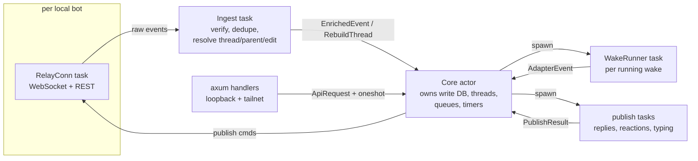
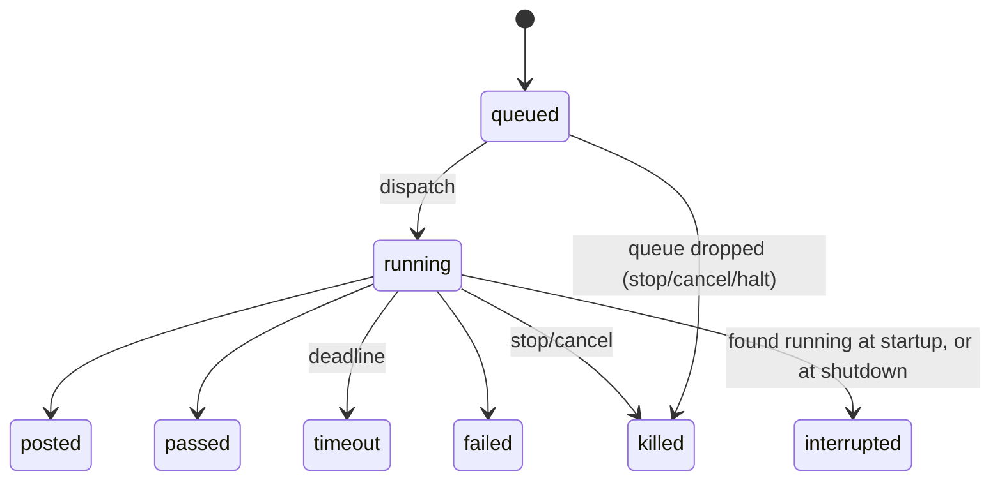

# buzz-router v1 Design

**Phase status:** Approved

**Approval:** Approved by David on 2026-10-05 ("approved"), with design assumptions DA-1–DA-4 accepted as written. Approve and execute: granted.

## 1. Overview

This design implements [requirements.md](requirements.md) (Requirements 1–66, assumptions A1–A18), with the [design brief](brief.md) as the architectural source. It is meant to be executed cold by implementers who are not Rust specialists, so it names crates, modules, types, SQL, and the order of operations. Section 20 traces every design section to requirement ids, and every requirement id back to sections.

What it adds beyond the requirements:

- design choices the requirements leave open, collected with rationale in section 18 (DD-n);
- a short list of design assumptions that need David's confirmation, in section 19 (DA-n).

Facts about Buzz were checked against the read-only checkout at commit `f0eb5575ffc9d5f57af4ed3f574529d997c83a0d`. Each one cites a file in that checkout.

The system has two crates:

- `router-core`: a pure library. It holds configuration types and validation, author classification, parsing, `route()`, the limit gates, prompt and payload rendering, and an offline replay simulator.
- `buzz-router`: the binary. It holds relay connections, the SQLite store, the wake engine, adapters, the HTTP API, the CLI and service installation.

## 2. Conventions for implementers

These rules apply to every task. The repository's Rust standard is still `draft` (AGENTS.md), so these are the binding rules for v1.

- **Toolchain:** Rust ≥ 1.88 (`rust-version = "1.88"`), edition 2021, resolver 2. These match Buzz's workspace (`Cargo.toml` at the pinned rev).
- **No `unwrap`, `expect`, `panic!`, `todo!` or `dbg!` outside tests.** This is enforced by workspace lints (section 3.1) and `clippy.toml` with `allow-unwrap-in-tests = true` and `allow-expect-in-tests = true`.
- **Errors:** `thiserror` enums in `router-core` and in each `buzz-router` module, and `anyhow` only at the binary edge (`main`, CLI dispatch), where errors map to exit codes (section 14).
- **Gates:** `cargo fmt --all --check` and `cargo clippy --workspace --all-targets --locked -- -D warnings` must pass in CI on all three OSes.
- **No `unsafe`:** `unsafe_code = "forbid"` at workspace level. Process-group handling comes from `command-group` and `nix`.
- **Determinism in `router-core`:** use `BTreeMap` and `BTreeSet` (never `HashMap` or `HashSet`) wherever iteration order can reach output. Decisions are sorted by bot name.
- **No secrets in logs:** never log wake tokens, nsecs, the admin token, webhook secrets, or payload JSON (which contains the token).
- **Placeholders only** in example configs and fixtures. Fixture keys are derived from public seeds (section 16.1).

## 3. Workspace, crates and dependencies

### 3.1 Layout

```
buzz-router/
  Cargo.toml                    workspace: members, [workspace.dependencies], [workspace.lints]
  Cargo.lock                    committed; CI builds with --locked
  clippy.toml                   allow-unwrap-in-tests, allow-expect-in-tests
  rustfmt.toml                  edition = "2021"
  crates/router-core/           pure library (section 5); no tokio, no I/O
    src/lib.rs                  re-exports
    src/ids.rs                  BotName, Pubkey, EventId, ChannelId newtypes
    src/config/{mod,roster,router,validate,limits}.rs
    src/classify.rs
    src/parse/{mod,text,mentions,everyone,control,nip19}.rs
    src/thread.rs               ThreadState, thread_position()
    src/route/{mod,owner,bot,human,edit,gates}.rs
    src/quiet.rs
    src/prompt.rs               built-in template, render()
    src/payload.rs              WakePayload model and builder
    src/replay.rs               offline simulator for `route --replay`
    tests/conformance.rs        runs fixtures/conformance/*.json
  crates/buzz-router/           the daemon and CLI (sections 6–14): a library target plus a thin binary
    src/lib.rs                  library target; holds every module below, so tests/ can reach them
    src/main.rs                 binary `buzz-router`; only calls buzz_router::cli::main()
    src/cli/{mod,run,status,control,agent,wakes,capture,replay,keys,roster,service}.rs
    src/paths.rs  src/clock.rs  src/keys.rs  src/logging.rs
    src/store/{mod,schema,events,threads,wakes,posts,halts,cursors}.rs
    src/relay/{mod,conn,auth,rest,discovery,backfill}.rs
    src/ingest.rs               signature check, dedupe, thread/parent/edit resolution
    src/core/{mod,apply,queue,dispatch,timers,control,status}.rs
    src/adapter/{mod,command,webhook}.rs
    src/publish.rs              replies, status notes, reactions, typing
    src/api/{mod,token,admin,error,admin_token}.rs
    src/service/{mod,macos,linux,windows}.rs
    tests/support/mod.rs        shared test support: FakeRelay, FakeAdapter, test_agent_path() (sections 16.2, 16.3)
    tests/engine_*.rs           fake clock, fake relay, fake adapters (section 16.2)
    tests/e2e_*.rs              local-relay acceptance, ignored unless BUZZ_E2E=1
  crates/test-agent/            publish = false; binary `buzz-router-test-agent` (section 16.3)
  fixtures/conformance/         one JSON file per brief §15.1 case, plus extras (section 16.1)
  roster.example.toml  router.example.toml
  .github/workflows/ci.yml  .github/workflows/release.yml
```

Workspace lints in the root `Cargo.toml`, inherited by every crate with `[lints] workspace = true`:

```toml
[workspace.lints.rust]
unsafe_code = "forbid"

[workspace.lints.clippy]
unwrap_used = "deny"
expect_used = "deny"
panic = "deny"
todo = "deny"
dbg_macro = "deny"
```

### 3.2 Dependencies

Unless noted, versions are those Buzz's workspace pins at the reference commit (`Cargo.toml`, `[workspace.dependencies]`), which shows they exist and work together. "Verified" means checked on crates.io on 2026-10-05.

| Crate | Version and features | Used in | Notes |
|---|---|---|---|
| `buzz-core` | git `https://github.com/block/buzz`, `rev = "f0eb5575ffc9d5f57af4ed3f574529d997c83a0d"` | core, binary | `nip10`, `kind` constants (R62.3–62.5) |
| `buzz-sdk` | same git and rev | core, binary | `builders`, `mentions`, `nip_oa`, `ThreadRef` |
| `nostr` | `0.44` | core, binary | Same minor as Buzz, so types unify. Buzz enables `nip44` and `nip98` through feature unification. |
| `tokio` | `1`: `rt-multi-thread`, `macros`, `net`, `time`, `sync`, `io-util`, `signal`, `process`; dev: `test-util` | binary | paused time drives the fake clock (section 16.2) |
| `tokio-util` | `0.7` | binary | `CancellationToken` |
| `futures-util` | `0.3` | binary | WebSocket sink and stream, `BoxFuture` |
| `tokio-tungstenite` | `0.29`: `rustls-tls-webpki-roots` | binary | relay WebSocket |
| `reqwest` | `0.13`, `default-features = false`: `json`, `rustls` | binary | relay REST, webhooks |
| `rustls` | `0.23`, `default-features = false`: `ring`, `std` | binary | install the ring provider at startup, as `buzz-acp` does (`crates/buzz-acp/src/lib.rs` `tokio_main`) |
| `axum` | `0.8` (default features) | binary | HTTP API |
| `rusqlite` | `0.40` (verified 0.40.2): `bundled` | binary | no system SQLite (R58.2) |
| `keyring` | `4.2.0`, `default-features = false`, features `["v1"]` | binary | macOS Keychain (`apple-native-keyring-store`), Windows Credential Manager (`windows-native-keyring-store`) and Linux Secret Service over D-Bus (`zbus-secret-service-keyring-store`, pure Rust, synchronous). Owner decision O6. |
| `keyring-core` | `1` (locked `1.0.0`) | binary | Provides `Entry` and the mock store. Production installs the native store once with `keyring::Entry::store_status()`, then creates every entry as a `keyring_core::Entry`; tests install `keyring_core::mock::Store` instead. Owner decision O6. |
| `command-group` | `5.0.1` (verified): `with-tokio` | binary | process group (Unix) and Job Object (Windows) |
| `nix` | `0.31`: `signal`, `process` (Unix only, `cfg(unix)`) | binary | `killpg` for the CLI stop fallback (section 6.7) |
| `chrono` | `0.4`: `serde` | core, binary | `DateTime<Utc>` |
| `chrono-tz` | `0.10` (verified 0.10.4) | core | IANA zones (R2.3, R22.1) |
| `serde`, `serde_json` | `1` (`derive`) | core, binary | |
| `toml` | `1.0` (as `buzz-acp` uses) | core | config parsing |
| `regex` | `1` | core | the `@everyone` regex (R7.1), `nostr:` URI removal (R29.2) |
| `clap` | `4`: `derive`, `env` | binary | CLI |
| `tracing` | `0.1` | binary | |
| `tracing-subscriber` | `0.3`: `env-filter`, `json` | binary | |
| `tracing-appender` | `0.2` | binary | daily rolling log file |
| `directories` | `6` (verified 6.0.0) | binary | `BaseDirs` (R3.4) |
| `hmac` | `0.13` | binary | webhook signature (R38.1) |
| `sha2` | `0.11` | core, binary | roster hash, token hash, HMAC |
| `hex` | `0.4` | core, binary | |
| `base64` | `0.22` | binary | NIP-98 `Authorization: Nostr` header |
| `subtle` | `2.6` | binary | constant-time admin-token comparison |
| `getrandom` | `0.4` | binary | wake token and admin token bytes |
| `uuid` | `1`: `v4`, `serde` | core, binary | wake ids, channel ids |
| `url` | `2` | binary | relay URL parsing |
| `thiserror` | `2` | core, binary | |
| `anyhow` | `1` | binary (edge only) | |
| `tempfile` | `3` (dev) | tests | |

`router-core` depends only on `buzz-core`, `buzz-sdk`, `nostr`, `chrono`, `chrono-tz`, `serde`, `serde_json`, `toml`, `regex`, `sha2`, `hex`, `uuid` and `thiserror`. A CI step asserts that `cargo tree -p router-core -e normal -i tokio` finds nothing (R5.9).

### 3.3 Buzz git dependency check

I had no shell, so this check was done by reading the manifests at the reference commit. Task 1 confirms it with `cargo tree -p router-core`.

- `crates/buzz-core/Cargo.toml` and `crates/buzz-sdk/Cargo.toml` inherit `version`, `edition`, `rust-version`, `license` and `repository`, plus every dependency, with `workspace = true`.
  - Cargo resolves workspace inheritance for git dependencies from the root manifest of the git checkout. This has been supported since Cargo 1.64, so it works with 1.88.
  - The inherited dependency entries are all crates.io versions (`nostr 0.44`, `serde 1`, `serde_json 1`, `thiserror 2`, `uuid 1`, `chrono 0.4`, `hex 0.4`, `hmac 0.13`, `sha2 0.11`, `base64 0.22`, `rand 0.10`, `subtle 2.6`, `zeroize 1.8`, `url 2`, plus `percent-encoding 2.3` declared directly). **These resolve.**
- `buzz-sdk` depends on `buzz-core` through the workspace entry `buzz-core = { path = "crates/buzz-core" }`. Inside a git dependency, that path resolves within the same checkout. **This resolves.**
- Buzz's root `[patch.crates-io]` (`aws-creds`, `sqlx-sqlite`) is **ignored for dependents**, because patches apply only in the top-level workspace. Neither `buzz-core` nor `buzz-sdk` depends on either crate, so ignoring the patches has no effect. Buzz's `[profile.*]` sections are ignored too.
- Neither crate depends on tokio, sqlx, redis or axum (`buzz-core` says so explicitly). So `router-core` stays I/O-free.
- No manifest in the checkout uses `cargo-features`, edition 2024 or `[lints]`, so Cargo 1.88 can parse every member manifest when it loads the repository.
- **Nothing found that would fail to resolve.** One residual risk: the pinned `rev` must stay reachable on GitHub. If it doesn't, vendor the two crates under `vendor/` at the same rev (DA-3).

## 4. Configuration

Requirements: 1, 2, 3, 22.3; assumptions A2, A3, A15.

### 4.1 Paths

`buzz-router/src/paths.rs` resolves two directories with `directories::BaseDirs`:

- `config_dir = BaseDirs::config_dir()/"buzz-router"`. That gives `~/Library/Application Support/buzz-router` on macOS, `~/.config/buzz-router` on Linux (honouring `XDG_CONFIG_HOME`), and `%APPDATA%\buzz-router` on Windows (R3.1–3.4).
- `data_dir = BaseDirs::data_local_dir()/"buzz-router"`. That gives `~/Library/Application Support/buzz-router`, `~/.local/share/buzz-router`, and `%LOCALAPPDATA%\buzz-router` (DD-11). The data directory holds `state.sqlite3`, `admin.token`, `logs/`, and `wakes/<wake_id>/` scratch directories (R3.5).
- Hidden global flags `--config-dir` and `--data-dir`, and the env vars `BUZZ_ROUTER_CONFIG_DIR` and `BUZZ_ROUTER_DATA_DIR`, override both. They exist for tests and E2E only (DD-11).

Configuration is read once at startup. Changes take effect on restart (A15).

### 4.2 Schema structs (`router-core/src/config/`)

Raw structs mirror the TOML exactly and use `#[serde(deny_unknown_fields)]` (DD-19). After validation they become resolved types.

```rust
// roster.toml
pub struct RosterFile {
    pub version: u32,                         // must be 1 (A3)
    pub owner: OwnerFile,
    #[serde(default)] pub limits: LimitsFile,
    #[serde(default)] pub channels: Vec<ChannelFile>,
    pub bots: Vec<BotFile>,
}
pub struct OwnerFile { pub name: String, pub pubkeys: Vec<String>, pub timezone: String }
#[derive(Default)]
pub struct LimitsFile {                       // every field optional; defaults per R2.5
    pub turns_per_round: Option<u32>,
    pub wakes_per_hour: Option<u32>,
    pub wakes_per_day: Option<u32>,
    pub quiet_hours: Option<String>,          // "" disables, else "HH:MM-HH:MM"
    pub discussion_debounce_secs: Option<u64>,
    pub discussion_debounce_max_secs: Option<u64>,
    pub max_wake_minutes: Option<u64>,
    pub max_posts_per_wake: Option<u32>,
    pub status_note_after_secs: Option<u64>,
}
pub struct ChannelFile { pub id: uuid::Uuid, pub name: String, #[serde(default)] pub default_bot: String }
pub struct BotFile {
    pub name: String,
    pub pubkey: String,
    #[serde(default)] pub aliases: Vec<String>,
    pub channels: Vec<String>,                // ["*"] or channel UUID strings
    pub respond_to: RespondTo,                // "owner-only" | "anyone"
    #[serde(default)] pub machine: Option<String>,
    #[serde(default)] pub limits: LimitsFile,
}

// router.toml
pub struct RouterFile {
    pub relay_url: String,
    #[serde(default)] pub api_bind: Option<std::net::SocketAddr>,  // default 127.0.0.1:47821
    #[serde(default)] pub tailnet_bind: String,                   // "" = off
    #[serde(default)] pub public_url: String,
    #[serde(default)] pub roster_path: Option<String>,             // default "roster.toml"
    pub bots: Vec<RouterBotFile>,
}
pub struct RouterBotFile {
    pub name: String,
    pub key: String,                          // "keychain" | "file:<path>"
    #[serde(default)] pub auth_tag: String,
    #[serde(default)] pub max_concurrent: Option<u32>,            // default 1
    pub adapter: AdapterFile,
}
#[serde(tag = "type", rename_all = "lowercase", deny_unknown_fields)]
pub enum AdapterFile {
    Command {
        command: Vec<String>,
        cwd: String,                          // leading "~" expanded to the home dir (DD-19)
        #[serde(default)] env: std::collections::BTreeMap<String, String>,
        prompt_mode: PromptMode,              // "stdin" | "file"
        reply_mode: ReplyMode,                // "stdout" | "api"
        #[serde(default)] prompt_template: String,
    },
    Webhook {
        url: String,
        secret_env: String,
        mode: WebhookMode,                    // "async" | "sync"
        #[serde(default)] cancel_url: String,
    },
}
```

The resolved types are `Roster` and `RouterConfig`:

- `Roster` holds the owner (pubkeys as `Pubkey`, `chrono_tz::Tz`), a `BTreeMap<BotName, Bot>`, each bot's effective `Limits` (per-bot values over `[limits]` over defaults, R2.6), and a `name_index: BTreeMap<String, BotName>` from lowercased names and aliases to bots (R2.11).
- `RouterConfig` holds the resolved binds, the `public_url` without a trailing slash, and per-bot `KeySource`, `auth_tag: Option<nostr::Tag>` (parsed with `buzz_sdk::nip_oa::parse_auth_tag`), `max_concurrent` and adapter.

### 4.3 Validation (`config/validate.rs`)

`validate_roster(&RosterFile) -> Result<Roster, ConfigErrors>` and `validate_router(&RouterFile, &Roster) -> Result<RouterConfig, ConfigErrors>` collect **every** issue before returning. Each issue carries a TOML path and a message.

**Rules from the requirements:**
- The parse fails on a missing required key or an out-of-set value (A2, R1.13).
- `version == 1`, and `owner.timezone` parses as a `chrono_tz::Tz` (R2.3).
- `quiet_hours` is `""` or matches `^\d{2}:\d{2}-\d{2}:\d{2}$` with valid times (R22.3).
- Every `router.toml` bot name exists in the roster (R1.7). `key` is `keychain` or `file:<path>` (R1.8).
- `max_concurrent` is at least 1, and a command adapter's `command` is non-empty (owner decision O2).

**Rules from A3:**
- Names and aliases are unique, case-insensitively, across the roster. Pubkeys are unique.
- No bot is named `all`, in any ASCII case: `all` is the halt scope covering every bot (owner decision O2).
- No two channels share an id (owner decision O2).
- No pubkey is both an owner key and a bot key.
- A `default_bot` that is set names a roster bot.
- An async webhook bot requires non-empty `public_url` and `tailnet_bind`.
- `api_bind` is a loopback address, and `tailnet_bind` is not `0.0.0.0` or `::`.
- Pubkeys are 64 hex characters. Channels are `["*"]` or a list of UUIDs.

`roster_hash(bytes) -> String` returns the lowercase hex SHA-256 of the roster file's bytes (R2.13, R2.16). File-key permission checks need I/O, so they live in `buzz-router/src/keys.rs` (section 11).

## 5. router-core

### 5.1 Identifiers (`ids.rs`)

`BotName(String)`, `Pubkey(String)` (64 lowercase hex), `EventId(String)` (64 lowercase hex) and `ChannelId(uuid::Uuid)` are newtypes deriving `Clone, Debug, PartialEq, Eq, PartialOrd, Ord, Hash, Serialize, Deserialize`. Constructors validate the format.

### 5.2 Core types and the `route()` signature

Requirements: 5, 18.1.

```rust
pub const KIND_MESSAGE: u16 = buzz_core::kind::KIND_STREAM_MESSAGE as u16;       // 9
pub const KIND_EDIT: u16 = buzz_core::kind::KIND_STREAM_MESSAGE_EDIT as u16;     // 40003

/// A signature-verified kind-9 or kind-40003 event. The binary builds it from nostr::Event.
pub struct InEvent {
    pub id: EventId,
    pub pubkey: Pubkey,
    pub kind: u16,
    pub created_at: i64,               // unix seconds
    pub channel: ChannelId,            // from the `h` tag; events without one are not routed
    pub content: String,
    pub tags: Vec<Vec<String>>,        // raw tag arrays
}

pub enum ThreadPos { TopLevel, Reply { root: EventId, parent: EventId } }   // parent == root: direct reply
/// Uses buzz_core::nip10::parse_thread_markers_from_parts + ThreadMarkers::resolve (R62.4).
pub fn thread_position(tags: &[Vec<String>]) -> ThreadPos;

pub enum RoundMode { Direct, Discussion }
pub struct ThreadState {
    pub root_id: EventId,
    pub channel_id: ChannelId,
    pub participants: BTreeSet<BotName>,
    pub discussion: bool,
    pub round_id: EventId,
    pub round_mode: RoundMode,
    pub round_started_at: i64,
    pub turns_used: BTreeMap<BotName, u32>,      // wakes dispatched in this round (R5.4, R18.1)
}

pub struct Halts { pub all: bool, pub bots: BTreeSet<BotName> }
pub struct WakeCounts { pub hour: u32, pub day: u32 }    // trailing windows (A10)
pub struct EditTarget { pub message_id: EventId }        // the edited kind-9 message

pub struct Snapshot<'a> {
    pub roster: &'a Roster,
    pub local_bots: &'a BTreeSet<BotName>,
    pub local_members: BTreeSet<BotName>,        // local bots that are members of ev.channel (DD-5)
    pub halts: &'a Halts,
    pub thread: Option<ThreadState>,             // the event's thread (for an edit: the edited message's thread)
    pub parent_author: Option<Pubkey>,           // author of the reply parent when parent != root
    pub edit_target: Option<EditTarget>,
    pub wake_counts: &'a BTreeMap<BotName, WakeCounts>,
    pub quiet: BTreeSet<BotName>,                // bots inside quiet hours at `now` (section 5.6)
}

pub fn route(ev: &InEvent, snap: &Snapshot<'_>, now: DateTime<Utc>) -> RouteResult;

pub struct RouteResult {
    pub control: Option<Control>,
    pub decisions: Vec<Decision>,                // at most one per local bot, sorted by bot name
    pub thread_update: ThreadUpdate,
    pub wake_mode: RoundMode,                    // mode carried by this event's wakes (DD-3)
    pub diagnostics: Vec<Diagnostic>,            // e.g. RosterDrift { pubkey }, StatusTagIgnored
}
pub enum Control { Stop(Scope), Resume(Scope), Cancel(Scope) }
pub enum Scope { All, Bots(BTreeSet<BotName>) }
pub enum Decision {
    Wake { bot: BotName, reason: Reason, priority: Priority, debounce: bool },
    Suppress { bot: BotName, why: SuppressWhy },
}
#[serde(rename_all = "snake_case")]
pub enum Reason { Mention, Everyone, ReplyTarget, Participant, DefaultBot, Discussion, BotMention }
#[serde(rename_all = "snake_case")]
pub enum Priority { Owner, Human, Bot }          // Ord: Owner > Human > Bot for queueing
pub enum SuppressWhy { Halted, Cap, Quiet, Budget, RespondTo }

pub struct ThreadUpdate {
    pub create: Option<NewThread>,               // { root_id, channel_id }; created by a top-level post
    pub add_participants: BTreeSet<BotName>,
    pub set_discussion: bool,
    pub new_round: Option<NewRound>,             // { round_id: EventId, mode: RoundMode, started_at: i64 }
}
```

`Decision`'s shape is exactly the one in R5.3. The wake's round mode, which the status note and ✅ need, travels in `RouteResult::wake_mode` (DD-3). The `Snapshot` holds every field R5.4 lists: turns used are inside `thread`, and the quiet-hours flag is the `quiet` set.

### 5.3 Classification (`classify.rs`)

Requirement 4.

```rust
pub enum AuthorClass { Owner, Bot(BotName), ForeignBot { owner_is_ours: bool }, Human }
pub fn classify(ev: &InEvent, roster: &Roster) -> AuthorClass;
```

The order is owner, then bot, then foreign_bot, then human (R4.2). For `ForeignBot`, take the event's `auth` tag, serialise its parts to JSON (`serde_json::to_string(&tag)`), and call `buzz_sdk::nip_oa::verify_auth_tag(&json, &author_pubkey)` (`crates/buzz-sdk/src/nip_oa.rs`). A verification failure falls through to `Human` (R4.3). `owner_is_ours` is true when the returned owner pubkey is in `owner.pubkeys`. `route` then emits `Diagnostic::RosterDrift`, and the binary logs it once per pubkey per process (R4.4, A12).

### 5.4 Parsing (`parse/`)

Requirements: 7.1, 17, 29.2–29.6; assumption A18.

**Mention text.** `text::mention_text(content)` runs `buzz_sdk::mentions::strip_code_regions`, then replaces every line whose first character is `>` with an empty line (R17.1).

**Mentioned bots.** `mentions::mentioned_bots(ev, class, roster, author: Option<&BotName>) -> BTreeSet<BotName>` is the union of three sets, minus the author:

1. Text mentions: `buzz_sdk::mentions::extract_at_mentions_with_known(&mention_text, &names)`, where `names` holds every roster name and alias. The results come back lowercased (`crates/buzz-sdk/src/mentions.rs:107`) and are mapped through `roster.name_index`. Unknown tokens are dropped (R17.2).
2. URI mentions:
   - `buzz_sdk::mentions::extract_nostr_uris(&mention_text)` for `nostr:npub1…`;
   - plus `nip19::nprofile_pubkeys(&mention_text)`. This scans `nostr:nprofile1` followed by bech32 characters, lowercases the candidate, and decodes it with `nostr::nips::nip19::Nip19Profile::from_bech32` (A18 resolution).

   The resulting pubkeys are mapped to roster bots (R17.3).
3. `p`-tag mentions, only when `class` is `Owner` or `Human`: `p` tags whose value is a roster bot pubkey and not the author's pubkey (R17.4).

**`@everyone`.** `everyone::contains_everyone(&mention_text)` uses the regex `(?i)(^|\s)@everyone\b`, compiled once with `std::sync::LazyLock`. Callers check `class == Owner` (R7.1, R7.2).

**Control.** `control::parse_control(content, roster, mentioned) -> Option<Control>`:

1. `s = strip_code_regions(content)`.
2. Replace `@everyone` matches (same regex), roster `@names` and aliases, and `nostr:` URIs (`(?i)nostr:[0-9a-z]+`) with spaces.
   - Names match the way `extract_at_mentions_with_known` matches them: an `@` at the start or after whitespace, then a name tried longest first, case-insensitively, followed by a word boundary.
3. Lowercase, then map every char that is neither `char::is_alphanumeric` nor `!` to a space.
4. `words = s.split_whitespace()`.
5. Match in this order:
   - one word `!cancel` gives `Cancel`;
   - one word `resume` gives `Resume`;
   - 1 to 5 words, any of which is `stop`, `halt` or `!shutdown`, gives `Stop`.
6. Scope is `Scope::All` when `mentioned` is empty, otherwise `Scope::Bots(mentioned)` (R29.2–29.6).

### 5.5 The `route()` algorithm (`route/`)

Requirements: 4.5, 5.7, 5.8, 6–16, 19.2, 20.2, 21.2, 22.4, 29.1, 29.7, 30.4.

Shared helpers:

- `covers(bot, channel, snap)` is true when the bot is in `snap.local_members` and its `channels` is `*` or contains `channel`. For bots that aren't local (they matter only as participants), it is true when the bot's `channels` explicitly lists the channel (DD-5).
- `consider(bot)` means `bot ∈ snap.local_bots && covers(bot)`. Only considered bots get decisions (R5.7, R5.8).
- `gate(bot, gates, snap) -> Option<SuppressWhy>` evaluates gates in the order given:
  - `Halted` when `halts.all || halts.bots.contains(bot)`;
  - `Quiet` when `quiet.contains(bot)`;
  - `Cap` when `thread.turns_used[bot] >= limits(bot).turns_per_round`;
  - `Budget` when `counts.hour >= wakes_per_hour || counts.day >= wakes_per_day`.

```text
route(ev, snap, now):
  if ev has tag ["buzz-router", _, "status"]          -> empty result + StatusTagIgnored     (R4.5)
  class = classify(ev, roster)
  match (ev.kind, class):
    (EDIT, Owner)    -> owner_edit                                                          (R16)
    (EDIT, _)        -> empty result                                                        (R16.5)
    (MESSAGE, Owner) -> owner_message
    (MESSAGE, Bot b) -> bot_message(b)
    (MESSAGE, Human) -> human_message
    (MESSAGE, ForeignBot) -> foreign_message
```

**owner_message** (R6–R10, R29):

1. `m = mentioned_bots(ev, Owner, ...)`. If `parse_control(content, roster, m)` is `Some`, return it in `control`, with no decisions and an empty `thread_update` (R29.1).
2. `pos = thread_position(tags)`. `thread = snap.thread`, which is `None` for a new top-level root.
3. Find the first matching rule:
   - **(a)** `contains_everyone`: targets are every roster bot with `covers`; reason `Everyone`, mode `Discussion`, `set_discussion = true` (R7.3–7.5).
   - **(b)** `m` is non-empty: targets are `m`; reason `Mention`, mode `Direct` (R6.2, R6.3).
   - **(c)** `pos = Reply{root, parent}`, `parent != root`, and `parent_author` is a roster bot `b`: target `b`; reason `ReplyTarget`, mode `Direct` (R8.1, R8.2).
   - **(d)** `pos` is a reply and `thread.participants` is non-empty: targets are the participants; reason `Participant`; mode `Discussion` if `thread.discussion`, else `Direct` (R9).
   - **(e)** the channel's `default_bot` is set and the message is top-level or the thread has no participants: target `default_bot`; reason `DefaultBot`, mode `Direct` (R10.1).
   - **(f)** otherwise, no targets (R10.2).
4. If there are targets:
   - set `new_round = {ev.id, mode, ev.created_at}` and `add_participants ⊇ targets`;
   - set `create` if the message is top-level;
   - for each considered target, emit `Suppress(Halted)` if halted, else `Wake{Owner, debounce:false}` (R6.4–6.8).
5. Set `wake_mode = mode`.

**bot_message(b)** (R11–R13):

1. Add `b` to `add_participants`. If the message is top-level, set `create` and `new_round = {ev.id, Direct}` (the bot round, R13.1).
2. `m = mentioned_bots(ev, Bot, ..., Some(b))`, which uses text and URIs only. Each bot in `m` gets reason `BotMention` and joins `add_participants` (R11.3, R11.4).
3. If the thread's `round_mode == Discussion`, every other participant not already in `m` gets reason `Discussion` (R12.1, R12.2).
4. For each considered target, apply `gate([Halted, Quiet, Cap, Budget])`. A failure gives `Suppress(why)`; a pass gives `Wake{Bot, debounce:true}` (R12.4, R12.5).
5. Set `wake_mode = thread.round_mode`. Never a new round otherwise (R11.5).

**human_message** (R14):

1. `m = mentioned_bots(ev, Human, ...)`. The targets are `m` with reason `Mention`. If `m` is empty, the target is the reply target with reason `ReplyTarget` (A12).
2. For each considered target:
   - if `respond_to == OwnerOnly`, `Suppress(RespondTo)`;
   - else `gate([Halted, Quiet, Cap, Budget])`, and on a pass `Wake{Human, debounce:false}`.
3. No thread update.

**foreign_message** (R15): same target selection as human, except that a foreign bot's `p` tags count as mentions of local bots (owner decision O4, Reading 1: R15.2 wins over R17.4 for foreign bots). Every considered target gets `Suppress(RespondTo)`.

**owner_edit** (R16, A11):

1. If `edit_target` or `thread` is missing, return empty plus `Diagnostic::EditTargetUnknown`.
2. Targets are `p` tags naming roster bots, excluding the author. Text is not parsed (R16.6), and neither is control (R16.4). Reason `Mention`.
3. For each considered target, apply `gate([Halted, Cap])`. A pass gives `Wake{Owner, debounce:false}`.
4. Targets join `add_participants`. `wake_mode = Direct`. No round change.

### 5.6 Gates, limits and quiet hours (`quiet.rs`)

Requirements: 19–22; assumptions A1, A10.

`quiet_set(roster, now) -> BTreeSet<BotName>` returns every bot whose effective `quiet_hours` range contains the owner-timezone wall-clock time of `now`, using the half-open interval [start, end):

- if `start < end`: quiet when `start ≤ t < end`;
- if `start > end`: quiet when `t ≥ start || t < end`;
- if `start == end`: the interval is empty, so never quiet.

The engine calls this when it builds every `Snapshot`, so `route` reads no clock (R22.1, R22.6). `WakeCounts` are computed by the engine from `wakes.started_at` over the trailing 60 minutes and 24 hours (section 9.3, A10).

### 5.7 Prompt rendering and payload model (`prompt.rs`, `payload.rs`)

Requirements: 40, 41.

- `BUILT_IN_TEMPLATE: &str` is the brief §9.4 text verbatim (R41.1).
- `render(template: &str, vars: &PromptVars) -> String` replaces exactly `{bot}`, `{channel}`, `{reason_text}`, `{turn}`, `{turns_per_round}` and `{context}`. Any other `{…}` text is left as is (R41.2).
- `reason_text(reason, author_name)` returns the seven strings from R41.4.
- `render_context(&[ContextMessage])` produces one line per message, oldest first. Each line is `★ <author>: <first line>` for new messages or `  <author>: <first line>` for the rest, and continuation lines are indented 4 spaces (DD-17).

```rust
#[derive(Serialize)]
pub struct WakePayload {
    pub wake_id: uuid::Uuid,
    pub token: String,
    pub bot: String,
    pub channel: ChannelRef,                     // { id, name }
    pub thread_root_id: String,
    pub reply_parent_id: String,
    pub reason: Reason,                          // snake_case, e.g. "participant", "reply_target"
    pub round_mode: RoundMode,                   // "direct" | "discussion"
    pub turns_left_after_this: u32,
    pub turns_per_round: u32,
    pub deadline: String,                        // RFC 3339, seconds, "Z" suffix
    pub triggers: Vec<String>,
    pub context: Vec<ContextMessage>,            // { id, author, class, created_at, text, new }
    pub api: ApiRef,                             // { url, post: "/v1/post", pass: "/v1/pass", eta: "/v1/eta" }
}
```

`turns_left_after_this = turns_per_round − turns_used_after_increment` (R40.3).

### 5.8 Offline replay simulator (`replay.rs`)

Requirements: 55.2–55.4; assumption A17.

`Replayer::new(roster)` treats every roster bot as local and as a member of every channel it covers. `step(&mut self, ev: &InEvent) -> RouteResult` then works as follows:

1. Derive `now` from `ev.created_at`. This is the simulated clock.
2. Build a `Snapshot` from the simulator's own state: the thread map, an index of event id to author and root (for parent authors and edit targets), halts, and the wake counts and quiet set for that `now`.
3. Call `route`.
4. Apply the thread update and controls, and count every `Wake` as dispatched immediately, so Cap and Budget progress realistically.

The simulator never invents thread state for a root it never saw (owner decision O5): a reply under an unseen root is routed with no thread (`thread: None`), and a thread update for a thread that never started is dropped.

The simulator performs no I/O.

## 6. buzz-router daemon

### 6.1 Concurrency model

Requirements: 25.1, 26, 61.4.



- **Core actor** (`core/mod.rs`) is one tokio task that owns all mutable state and the SQLite write connection, and serialises every mutation (DD-1). Its loop:

  ```text
  loop {
    sleep = min(timers.next_due() - clock.now(), 1s), clamped at 0
    select! { msg = rx.recv() => handle(msg), _ = tokio::time::sleep(sleep) => {} }
    fire every timer with due <= clock.now()
    schedule()                    // dispatch eligible wakes (section 6.5)
  }
  ```

  The 1-second tick re-checks wall-clock deadlines after an OS sleep.

  Messages:
  - `Enriched(EnrichedEvent)`
  - `RebuildThread{root, events}`
  - `Memberships{bot, channels}`
  - `RelayState{bot, up}`
  - `Adapter{wake_id, AdapterEvent}`
  - `PublishResult{..}`
  - `Api(ApiRequest, oneshot::Sender<ApiResponse>)`
  - `Shutdown(oneshot::Sender<()>)`, the graceful stop (section 6.9)

  **Test seam.** `core::spawn_core(CoreDeps) -> CoreHandle` starts the actor. `CoreDeps` carries the store, roster, router config, clock, per-bot `RelayPort`s and adapters. `CoreHandle` exposes:
  - `ingest(bot, nostr::Event, Source)`, which feeds an event through the ingest pipeline;
  - `api(ApiRequest) -> ApiResponse`;
  - `flush()`, which resolves once the core has drained its queue (tests only);
  - `debug_counters()`, which returns the in-memory status counters (tests only).
- **Ingest task** (`ingest.rs`) is single and sequential, so arrival order is preserved. It holds a read-only SQLite connection and the per-bot REST clients (section 6.3).
- **RelayConn tasks** run one per local bot (section 10).
- **WakeRunner tasks** run one per running wake. Each runs the adapter, then reports `AdapterEvent`s. Cancellation is a `tokio_util::sync::CancellationToken` that the core triggers.
- **Clock** (`clock.rs`): `trait Clock: Send + Sync { fn now(&self) -> DateTime<Utc>; }`.
  - `SystemClock` returns `Utc::now()`.
  - `VirtualClock { base, start: tokio::time::Instant }` returns `base + (Instant::now() - start)`, for tests with `#[tokio::test(start_paused = true)]` (section 16.2).

  All timers use `tokio::time`.
- **Ports for testability:**
  - `trait RelayPort: Send + Sync` with `publish(&self, Event) -> BoxFuture<Result<(), RelayError>>` and `query(&self, Vec<Filter>) -> BoxFuture<Result<Vec<Event>, RelayError>>`. The production implementation is `RelayHandle` plus `RestClient`; tests use `FakeRelay`.
  - `trait Adapter` (section 7).

### 6.2 Startup and recovery

Requirements: 1.15, 43.4, 48, 49; assumption A14.

`buzz-router run`:

1. Install the rustls ring provider. Init logging (section 14). Resolve paths.
2. Load and validate the roster and `router.toml`. **On any error, print a JSON error and exit 1** (R1.15).
3. Open SQLite and migrate (section 9). Create `admin.token` if it's missing (R43.4).
4. Load each local bot's key (section 11). A bot whose key fails to load is marked `unavailable` in `status`, isn't connected, and doesn't stop the others (DD-23).
5. **Load halts** (R48.1 step 1).
6. **Recover interrupted wakes** (R49): for each `wakes` row in state `running`:
   1. Set `state = interrupted` and `ended_at = now`, and delete its `wakes/<id>/` scratch directory.
   2. **Re-queue when** `attempt == 1`, the bot isn't halted, the triggers include an owner trigger, **and** no `posts` row exists for that bot in that thread with `created_at ≥ started_at`. Check that last condition with `posts JOIN wakes ON posts.wake_id = wakes.id WHERE wakes.root_id = ?`.
   3. Re-queuing creates a **new** queued wake: same bot, root and triggers, `attempt = 2`, dispatchable now. If a queued wake for that (bot, root) already exists, merge into it instead, setting `attempt = 2`.
   4. **Otherwise**, the bot reacts ⚠️ on the reaction target (section 6.6) once its relay is up.
7. Start the core, the ingest task and the API listeners. Then start one RelayConn per available bot, which connects, discovers, backfills and goes live (section 10).
8. **Missed owner messages** (R48.3, DD-14): when a backfilled owner message is more than 24 hours older than `now`, the core still applies its thread update and control but drops its `Wake` decisions, recording `{event_id, channel_id, created_at}` in the in-memory `missed` list shown by `status` (DD-12).

**First run** (A14): a (bot, relay) pair with no cursor starts its cursor at connect time, so there is no history backfill.

### 6.3 Inbound pipeline (`ingest.rs` then `core/apply.rs`)

Requirements: 4.1, 16.7, 18.2, 47.3, 51, 61.4.

**Ingest**, for each raw event from a RelayConn (tagged with bot and source `Live` or `Backfill`):

1. Parse it as `nostr::Event` and check `event.verify()`. Drop it on failure (R4.1).
2. Ignore it unless its kind is 9 or 40003 and it has an `h` tag with a UUID (R61.3).
3. **Dedupe.** Skip if the id is in the in-memory forwarded set (an LRU of 100 000 entries) or `events.processed_at IS NOT NULL` (R47.3, R61.4).
4. **Resolve the thread:**
   - kind 9: `thread_position(tags)`;
   - kind 40003: the target is the unmarked `e` tag (`build_edit` emits `["e", <target>]`, `crates/buzz-sdk/src/builders.rs:407`). Look up its `root_id` in `events` or the forwarded map, else REST-query `{ids:[target]}` and resolve its thread (R16.7).
5. If a reply's root is neither known (forwarded set, `threads` table) nor the event itself, **fetch the thread**:
   - REST `{ids:[root]}` plus `{kinds:[9], "#e":[root]}`, paged as in section 10.4. This is `buzz-acp`'s thread fetch (`crates/buzz-acp/src/pool.rs`, around line 4407).
   - Send `RebuildThread{root, events}` to the core, containing **only events ordered before the current one** by `(created_at, id)`. The current event is then routed normally (DD-13, R18.2).
6. **Parent author:** when `parent != root`, look up the parent's author in the forwarded map or `events`, else REST `{ids:[parent]}`.
7. Forward `EnrichedEvent{bot, source, event, in_event, pos, parent_author, edit_target, received_at: clock.now()}` to the core.

**Core**, for each `EnrichedEvent`, in this order:

1. Run the idempotency check again, by `INSERT … ON CONFLICT DO NOTHING` and `processed_at`.
2. **Unmanaged posts** (R51): a kind-9 event whose author is a local bot's pubkey and whose id isn't in `posts`:
   - that bot reacts ⚠️ on the event;
   - `unmanaged_posts += 1` (in memory, DD-12);
   - the warning log is rate-limited to once per bot per hour.
3. Load the thread state, from memory or the `threads` and `turns` tables, and build the `Snapshot`:
   - halts are re-read from the `halts` table, so CLI-written halts count;
   - `local_members` come from discovery;
   - `wake_counts` come from the SQL in section 9.3;
   - `quiet = quiet_set(roster, now)`.
4. Call `route(&in_event, &snap, clock.now())`. Log diagnostics, `RosterDrift` once per pubkey.
5. **Apply in one SQLite transaction:**
   - upsert `events` with `processed_at`;
   - apply `thread_update` (create, participants, discussion, new round with `round_started_at`);
   - for each `Wake`: enqueue or coalesce (section 6.5);
   - for each `Suppress(Cap)` where `turns.cap_reacted = 0`: set it to 1 and schedule the ⏸️ reaction on this event (R19.3);
   - for each `Suppress(Budget)`: increment the in-memory per-bot counter and log at info (R20.4, R21.4);
   - for `control`: write or delete halt rows (section 6.7).
6. **After commit**, run side effects: ⏸️ reactions and control effects (kills, queue drops, 🛑 and ▶️). Then call `schedule()`. 👀 is reacted at dispatch (section 6.6), not here.
7. Advance the `cursors` row for (bot, `relay_url`) to `max(last_created_at, created_at)` (R47.4).

**RebuildThread handling** (R18.2–18.4):

1. For each event, in `(created_at, id)` order, build a `Snapshot` and call `route`, applying **only `thread_update`**. Controls and decisions are discarded, and nothing is published (A17).
2. Insert each event into `events` with `processed_at` set.
3. Compute turn counts for the current round:
   - `SELECT bot, COUNT(*) FROM wakes WHERE root_id = ? AND round_id = ? AND started_at IS NOT NULL GROUP BY bot` when that has rows;
   - otherwise count each roster bot's kind-9 posts in the fetched events with `created_at ≥ round_started_at`.
4. Write `threads` and `turns`.

Replay uses kind-9 events only, so participants added by historical edits aren't reconstructed (DD-25).

### 6.4 Thread cache

Requirement 18.

An in-memory `BTreeMap<EventId, ThreadState>` holds active threads, capped at 2 000 entries with least-recently-used eviction. Evicted threads reload from `threads` and `turns`. Every change is written through to SQLite in the apply transaction (R18.5). If a thread fetch fails after retries (section 10.4), the event is routed against a fresh, empty state for that root, and a warning is logged (DD-13).

### 6.5 Wake queue, coalescing and debounce (`core/queue.rs`)

Requirements: 23, 24, 25, 26; assumption A9.

Each local bot has a `BotQueue`, indexed by (root) for its queued wake, with a mirror in `wakes` rows where `state = 'queued'`. Each trigger is a JSON object in `wakes.triggers`:

```json
{"event_id":"<hex>","edit_id":null,"class":"owner","author":"David","reason":"mention",
 "priority":"owner","debounce":false,"mode":"direct","created_at":1696471200,"received_at_ms":1696471200123}
```

For an edit trigger, `event_id` is the edited message and `edit_id` is the kind-40003 event (DD-21).

**On a `Wake` decision** for (bot, root):

- **If** a queued wake exists for (bot, root), append the trigger to it. This holds whether or not another wake for the same pair is running, so there is at most one queued wake per pair and exactly one follow-up (R24.1–24.3).
- **Otherwise**, insert a new `wakes` row:

  | Column | Value |
  |---|---|
  | `id` | UUID v4 |
  | `state` | `queued` |
  | `attempt` | 1 |
  | `round_id` | the thread's current round |
  | `created_at` | now (ms) |

- **Then** recompute the wake's attributes from all its triggers (A9). The highest-priority trigger, latest among equals, gives `priority`, `reason`, mode and reason author. The wake is non-debounced if any trigger is non-debounced.

**`dispatch_after`** (R23.1–23.3, DD-2):

- non-debounced: `now`;
- debounced: `min(max(last_bot_post_at[root] + debounce_secs, first_trigger.received_at + debounce_secs), first_trigger.received_at + debounce_max_secs)`.
  - `last_bot_post_at[root]` is the core's in-memory receive time of the latest kind-9 roster-bot post in that thread, updated in step 5 of the core's apply.
  - The limits used are those of the woken bot.

**`schedule()`**, run after every message or timer:

1. For each bot that isn't halted, with `running < max_concurrent`, take the dispatchable queued wakes: those with `dispatch_after ≤ now` and no running wake for the same (bot, root).
2. Order them by priority (`Owner`, then `Human`, then `Bot`), then by `created_at` (FIFO), and dispatch until the bot's slots are full (R25.2, R26).
3. If a queued wake belongs to a halted bot, for example after a CLI halt, mark it `killed` with outcome `{"dropped":true}` and no reaction (DD-15).

### 6.6 Dispatch, lifecycle and timers (`core/dispatch.rs`, `core/timers.rs`)

Requirements: 19.1, 27, 34–36, 46; assumptions A6–A8.



**Dispatch** runs in R35.1's order:

1. `token = hex(getrandom 32 bytes)`, and `token_hash = hex(sha256(token))` (DD-10). Store only the hash.
2. `deadline = now + max_wake_minutes` (R27.1).
3. In one transaction:
   - `UPDATE wakes SET state='running', started_at, deadline, token_hash, round_id = <thread's current round>`;
   - upsert `turns (root, round, bot) used = used + 1` (R35.3).
4. **👀:** if any trigger has class `owner`, the bot reacts on the **reaction target** (R35.4, A8). The reaction target is the latest owner trigger's `event_id` by `(created_at, event_id)`, else the latest trigger's.
5. Publish a typing indicator and schedule `Typing(wake)` every 3 s (R35.5, section 6.8).
6. Schedule `Deadline(wake)`. If the wake is owner-caused (priority `Owner`) and its mode is `Direct`, also schedule `StatusNote(wake)` at `started_at + status_note_after_secs` (R46.1, R46.5).
7. Spawn a WakeRunner with a `WakeContext`: wake id, token, bot, adapter config, channel, root, reply parent (the reaction target), reason, reason author, mode, turns left, limits, deadline and trigger ids (R35.6).

**In-memory `RunningWake`:** `{posts: u32, passed: bool, eta: Option<String>, status_note_sent: bool, cancel: CancellationToken, end_cause: Option<EndCause>}`.

**Endings** (R36, R27.2, A6). Precedence is killed, then timeout, then posted, then passed, then failed.

| Cause | State | Reaction on the reaction target |
|---|---|---|
| Stop or cancel kills a running wake | `killed` | 🛑 |
| `Deadline` timer fires | `timeout`: kill the process group or cancel the HTTP call, revoke the token | ⌛ |
| A reply was published (API, stdout, or sync `{"text"}`) | `posted`, even if a command later exits non-zero | none |
| An API pass; stdout empty or exactly `[no-reply]` with exit 0; sync `{"pass":true}`; or api reply mode with exit 0 and neither post nor pass | `passed` | ✅ if owner-caused **and** Direct, else none (A7) |
| The adapter fails: spawn error, non-zero exit with no post, async webhook without a 2xx in 10 s, sync non-2xx or bad body, or a missing secret env var | `failed` | ⚠️ |

When a wake ends, the core:

- sets `state`, `ended_at` and `outcome` (`{"posted":[ids],"detail":"…"}`), which revokes the token, so later API calls return 410;
- cancels its timers and the WakeRunner;
- deletes `wakes/<id>/`, frees the slot, and calls `schedule()`.

**When a wake ends**, depending on adapter and mode (A6):

- **Command adapter:** at process exit.
  - In api reply mode, an API pass also ends it. The runner then kills the process group if it hasn't exited 5 s after the pass (DD-20).
- **Async webhook:** at the first `/v1/post` (outcome `posted`) or `/v1/pass`.
- **Sync webhook:** when the response arrives.

**Timers:**

- `StatusNote`: if the wake is still running with `posts == 0 && !passed && !status_note_sent`, publish the note (section 6.8) and set `status_note_sent` (R46.1–46.4).
- `Deadline`: end the wake as `timeout`.
- `Typing`: re-publish every 3 s while the wake is running.

### 6.7 Control execution (`core/control.rs`)

Requirements: 30–33; assumptions A4, A5.

**Halt storage** (R30.2, R30.3): one row per scope, `'all'` or a bot name. A bot is halted when either row exists.

**Stop(scope):**

1. In one transaction, `INSERT OR REPLACE` the halt rows: `'all'` for `Scope::All`, or one per named bot. `set_by_event` is the stop message id, or `"cli"` or `"admin-api"`.
2. For each in-scope local bot:
   - cancel running wakes with cause `killed`. Command adapters get the process group killed; webhook wakes get the token revoked and, when `cancel_url` is set, a background `POST cancel_url` (DD-16);
   - mark queued wakes `killed` with `{"dropped":true}`;
   - the bot reacts 🛑 on the stop message, for message-triggered stops only (R30.1, R33.2).

**Resume(scope)** (A4):

- `Scope::All` deletes every halt row.
- `Scope::Bots(S)` while an `'all'` row exists replaces it with one row per roster bot not in S, then deletes the rows for S.
- Each in-scope local bot reacts ▶️ on the resume message (R31.1).

**Cancel(scope):** stop's steps 2 and 3 without step 1. Each in-scope local bot reacts 🛑 on the cancel message (R32.1).

**Admin API** (R33.1, R33.2): `POST /v1/stop|resume|cancel {bots?}` calls the same functions with `set_by_event = "admin-api"` and no reactions. An omitted `bots` means `Scope::All`, applied to local bots.

**CLI fallback** (R33.3, R33.4): when `buzz-router stop` can't reach the admin API (connection refused or a 2 s timeout), the CLI:

1. opens SQLite itself and writes the halt rows, with `set_by_event = "cli"`;
2. for every `running` wake of an in-scope bot, reads `wakes/<id>/pid` (`<pid>\n`) and kills the tree:
   - Unix: `nix::sys::signal::killpg(Pid::from_raw(pid), SIGKILL)`. `command-group` makes the child the leader of its own group, so its pid is the pgid.
   - Windows: `taskkill /PID <pid> /T /F`.
3. exits 0 if the halts were written.

The daemon, if it's alive, honours the rows because it re-reads `halts` for every snapshot, every `/v1/post`, and every `schedule()`.

**Stop reach** (A5): a router acts only on control messages its bots receive. The runbook tells David that the CLI is the per-machine fallback.

### 6.8 Publishing (`publish.rs`)

Requirements: 35.5, 44, 45, 46.3, 59.3.

All events are signed with the bot's `nostr::Keys` (R59.3). Publishing goes over that bot's WebSocket: the core sends a `Publish{event, ack}` command and the RelayConn waits up to 10 s for `["OK", id, true]`. If the socket is down or the OK times out, it falls back once to REST `POST /events` (`RestClient::submit_event` pattern) (DD-7). Publish work runs in spawned tasks that report back to the core.

**Reply** (R44):

1. Compute mention pubkeys with `mentions_for_reply(text, roster)`. This is the same extractor, with `names` = bot names, aliases and `owner.name`. A bot name maps to its pubkey. The owner name maps to **every** owner pubkey (DD-18). A bare whole-word occurrence of the owner name (no `@`, any ASCII case) maps to every owner pubkey too (owner decision O3: the T1.4 interim reading, recorded as the spec).
2. `ThreadRef{root_event_id: root, parent_event_id: reaction target}`. `build_message`'s `thread_tags` emits the direct-reply or nested tag shape itself (`crates/buzz-sdk/src/builders.rs:178`).
3. `buzz_sdk::builders::build_message(channel, text, Some(&thread_ref), &mentions, false, &[], &[])`, then `.tag(auth_tag)` if set, then `.tag(["buzz-router", VERSION, "reply"])`, then `.sign_with_keys(&keys)`.
4. **Insert the `posts` row (`event_id`, bot, `wake_id`, `created_at`) before sending**, so the relay echo is never counted as unmanaged (R44.7, DD-6). Increment `RunningWake.posts`.
5. Send. On final failure, delete the `posts` row, decrement the counter, and answer the API with 502 (DD-22). The wake continues.

**Status note** (R46.2, R46.3): same as a reply, except:

- the text is `On it, this will take a bit.`, or `On it, about {eta}.` when `eta` is set;
- the tag is `["buzz-router", VERSION, "status"]`;
- it is threaded under the reaction target;
- it is recorded in `posts`, but doesn't count toward `RunningWake.posts`.

**Reaction** (R45.2): `buzz_sdk::builders::build_reaction(target, emoji)`, signed. Not recorded.

**Typing** (R35.5):

- Built like `buzz-acp`'s `build_typing_event` (`crates/buzz-acp/src/relay.rs:1005`): kind `KIND_TYPING_INDICATOR` (20002), empty content, an `h` tag, and `e` tags. When parent ≠ root, those are `["e", root, "", "root"]` plus `["e", parent, "", "reply"]`; when parent == root, only `["e", parent, "", "reply"]`.
- It's sent over the WebSocket only, and failures are ignored at debug level.
- The cadence is 3 s (`crates/buzz-acp/src/lib.rs:2879`).

**Halted bots:** the API returns 423 before any publish, and the core refuses to publish a reply or status note for a halted bot from any path: stdout or sync replies arriving after a halt are discarded (R30.5).

### 6.9 Shutdown (`cli/run.rs`, `core/mod.rs`)

Owner decision on review finding #7; the requirements say nothing about shutdown.

On ctrl-c, SIGTERM or a service stop, `run` sends the core `Shutdown` and waits for its answer. The core then:

1. For each running wake, triggers its `CancellationToken`, so the WakeRunner kills the agent as a stop or deadline does (section 7.1, step 6). It ends the wake exactly as startup recovery would (section 6.2, step 6): the row becomes `interrupted`, which revokes the token, the scratch directory is deleted, and an attempt-1 owner wake is re-queued as attempt 2, otherwise ⚠️ is reacted.
2. Waits at most `SHUTDOWN_WAKE_GRACE` (5 s) for the WakeRunners and pending publishes to finish, then answers and stops. Afterwards the tokio runtime gets 2 s more to wind down before the process exits.

The backstop is `kill_on_drop` on every command-adapter spawn. A WakeRunner still running when the runtime is dropped kills its child: on Unix through tokio's `kill_on_drop`, which reaches the group leader only; on Windows through the Job Object's kill-on-close, which also fires when the router process is terminated without a signal.

## 7. Adapters (`adapter/`)

Requirements: 36.5, 36.6, 37, 38, 39; assumptions A6, A13.

```rust
pub struct WakeContext { /* see section 6.6 */ }
pub enum AdapterEvent {
    Exited { code: Option<i32>, stdout: Option<String> },   // command adapter
    AsyncAccepted,                                          // webhook async 2xx
    SyncReply(SyncReply),                                   // Text(String) | Pass
    Failed(String),
}
pub trait Adapter: Send + Sync {
    fn run(&self, ctx: WakeContext, payload: WakePayload, cancel: CancellationToken)
        -> futures_util::future::BoxFuture<'static, AdapterEvent>;
}
```

Before calling `run`, the WakeRunner builds the payload:

- **Context:** a REST query `{ids:[root]}` plus `{kinds:[9], "#e":[root], limit: 20}`, merged, sorted ascending, last 20 kept (R40.5).
  - `new` is true for messages created after the `started_at` of this bot's previous dispatched wake in this thread, and for every message when there is none (DD-17).
  - `author` is the roster bot name, `owner.name`, or the first 12 characters of the npub.
  - If the query fails after retries, `context` holds only the trigger events cached in memory, and a warning is logged.
- **Channel name:** the roster `[[channels]].name`, else the discovered kind-39000 name, else the UUID.

### 7.1 Command adapter (`adapter/command.rs`)

1. Create `data_dir/wakes/<wake_id>/` and write `payload.json` (and `prompt.txt` when `prompt_mode = "file"`). On Unix, files are created with mode `0o600` through `OpenOptionsExt::mode`, because the payload contains the token (DD-21).
2. Render the prompt from `prompt_template` (the file is read at wake time) or `BUILT_IN_TEMPLATE` (R37.4).
3. Build the command:
   - `tokio::process::Command::new(&command[0]).args(&command[1..]).current_dir(cwd)`;
   - `.envs(env)`;
   - `.env("BUZZ_ROUTER_URL", loopback_base)`, `.env("BUZZ_ROUTER_WAKE_TOKEN", token)`, `.env("BUZZ_ROUTER_PAYLOAD", payload_path)`, and `BUZZ_ROUTER_PROMPT_FILE` in file mode;
   - then **`.env_remove("BUZZ_PRIVATE_KEY")` last**, so neither the inherited nor the configured env can supply it (R37.2, R37.3);
   - stdin piped (stdin mode) or null; stdout piped; stderr piped.
4. Spawn with `command_group::AsyncCommandGroup::group().kill_on_drop(true).spawn()`, with `kill_on_drop(true)` on the tokio command as well, getting an `AsyncGroupChild`. That is a process group on Unix and a Job Object on Windows (R37.1). Dropping it kills the child (section 6.9). Write `<pid>` to `wakes/<id>/pid` for the CLI fallback.
5. In stdin mode, write the prompt and drop stdin (R37.5). Read stdout into a buffer capped at 65 536 bytes, **draining and discarding the rest** so the child never blocks on a full pipe (R37.6). Forward stderr line by line to `tracing::info!` with `bot` and `wake_id` (R37.10).
6. `select!` on the child exiting or `cancel.cancelled()`. On cancel, call `child.kill()`, which kills the whole group (`killpg` or `TerminateJobObject`), then `wait()`.
7. Report `Exited{code, stdout: trimmed}` (stdout reply mode) or `Exited{code, None}` (api reply mode). The core applies the ending table in section 6.6 (R37.7–37.9).

**Limitation:** a descendant that calls `setsid` or `setpgid` (Unix) or breaks away from the Job Object (Windows) escapes the group kill. The test agent (section 16.3) uses a plain child.

### 7.2 Webhook adapter (`adapter/webhook.rs`)

- `body = serde_json::to_vec(&payload)`. `secret = std::env::var(secret_env)` is read at wake time; if it's missing, the result is `Failed`.
- `sig = hex(HMAC-SHA256(secret, body))`.
- `POST url` with `Content-Type: application/json`, `X-Buzz-Router-Signature: sha256=<sig>` and `X-Buzz-Router-Wake: <wake_id>`, through the shared rustls `reqwest::Client` (R38.1).
- **async:** a 10 s timeout. A 2xx gives `AsyncAccepted`; anything else, or the timeout, gives `Failed` (R38.2, R36.6, A13).
- **sync:** no client timeout; the core's deadline cancels the request (R39.3). A 2xx with `{"text": s}` gives `SyncReply::Text(s)`, and `{"pass": true}` gives `SyncReply::Pass`. Anything else gives `Failed` (R39.2).
- **Cancel** (DD-16): `POST cancel_url` with body `{"wake_id": "<uuid>"}` and the same two headers, a 5 s timeout, best-effort, logged.

## 8. HTTP API (`api/`)

Requirements: 28, 38.3, 38.4, 42, 43; assumption A13.

There are two axum routers:

- **Loopback** on `api_bind`: token routes plus admin routes.
- **Tailnet** on `tailnet_bind`, when it's set: token routes only, with a fallback of 404 for every other path, admin paths included (R43.3).

Both use `DefaultBodyLimit::max(70 * 1024)`.

| Route | Auth | Request | Success | Errors |
|---|---|---|---|---|
| `POST /v1/post` | Bearer wake token | `{"text": string}` | 200 `{"event_id": hex}` | 401 unknown or missing token; 423 halted; 410 wake ended; 429 over `max_posts_per_wake`; 400 bad JSON or text over 64 KiB; 502 publish failed |
| `POST /v1/pass` | Bearer wake token | none | 200 `{}` | 401, 410 |
| `POST /v1/eta` | Bearer wake token | `{"text": string}` | 200 `{}` | 401, 410, 400 |
| `GET /v1/status` | Bearer admin token | none | 200 status JSON (section 12.2) | 401 |
| `POST /v1/stop`, `/v1/resume`, `/v1/cancel` | Bearer admin token | `{"bots": [name, …]}` (optional) | 200 `{"scope": "all" \| [names]}` | 401, 400 for an unknown bot |

- **Token auth:** `Authorization: Bearer <hex>` is hashed with SHA-256 and looked up in `wakes.token_hash`, so ended wakes are still found and get 410 (R42.2, R42.4).
- **Admin token:** compared in constant time with `subtle::ConstantTimeEq` against the contents of `admin.token`.
- **Precedence for `/v1/post`** (R42.4): resolve the wake from the token; then 423 if the bot is halted (re-read from `halts`); then 410 if `state` is terminal; then 429 if `posts ≥ max_posts_per_wake`; otherwise publish (R27.3, R28.1, R30.5).
- **Async webhook:** the first accepted post ends the wake (A6).
- **Error body:** `{"error": "<code>", "message": "<detail>"}`, with codes `unauthorized`, `halted`, `wake_ended`, `too_many_posts`, `bad_request`, `publish_failed` and `not_found` (DD-22).
- Every handler sends an `ApiRequest` to the core and awaits a `oneshot` response, so all state changes stay serialised. The tailnet listener is plain HTTP (R38.4). Binds are validated by A3, so no public interface can be configured.

**Admin token creation** (R43.4): `api::admin_token::ensure(data_dir) -> Result<String, ApiError>` returns the existing token, or creates one: 32 random bytes, hex-encoded, written to `data_dir/admin.token`.

- On Unix, the file is created with `OpenOptions::new().write(true).create_new(true).mode(0o600)`.
- On Windows, it inherits the per-user ACL of `%LOCALAPPDATA%`.

## 9. SQLite store (`store/`)

Requirements: 18.5, 30.2, 34.3, 47.

**Build order.** The store, meaning the schema, migration 1 and the repositories, lands in Milestone 2 (tasks.md task 2.1), earlier than brief §17.4 places it, because ingest (§6.3) and the engine (§6.1) both depend on it. Recovery behaviour stays in Milestone 4: interrupted wakes, missed messages, unmanaged-post detection and `status` (§6.2 steps 6 and 8, §6.3 step 2, §12.2).

### 9.1 Connection setup

`state.sqlite3` in the data directory, opened with `rusqlite` (`bundled`). Every connection sets `PRAGMA journal_mode = WAL; PRAGMA synchronous = NORMAL; PRAGMA busy_timeout = 5000;`.

- The core holds the only write connection in the daemon.
- The ingest task opens read-only (`SQLITE_OPEN_READ_ONLY`).
- CLI commands open their own connection.
- The schema version lives in `PRAGMA user_version`. Migration 1 runs in one transaction when `user_version = 0`.

### 9.2 DDL (migration 1)

The columns are exactly R47.2's. Types and indexes are design choices: Nostr times are unix seconds, and router-local times are unix milliseconds.

```sql
CREATE TABLE events (
  id            TEXT PRIMARY KEY,          -- 64-hex event id
  channel_id    TEXT NOT NULL,             -- channel UUID
  root_id       TEXT NOT NULL,             -- thread root; = id for top-level
  author        TEXT NOT NULL,             -- 64-hex pubkey
  class         TEXT NOT NULL,             -- owner | bot | foreign_bot | human
  kind          INTEGER NOT NULL,          -- 9 | 40003
  created_at    INTEGER NOT NULL,          -- unix s
  processed_at  INTEGER                    -- unix ms; NULL until routed
);
CREATE INDEX events_root ON events(root_id, created_at);

CREATE TABLE cursors (
  bot             TEXT NOT NULL,
  relay_url       TEXT NOT NULL,
  last_created_at INTEGER NOT NULL,        -- unix s
  PRIMARY KEY (bot, relay_url)
);

CREATE TABLE threads (
  root_id          TEXT PRIMARY KEY,
  channel_id       TEXT NOT NULL,
  participants     TEXT NOT NULL DEFAULT '[]',   -- JSON array of bot names
  discussion       INTEGER NOT NULL DEFAULT 0,
  round_id         TEXT NOT NULL,
  round_mode       TEXT NOT NULL,                -- direct | discussion
  round_started_at INTEGER NOT NULL              -- unix s (created_at of round_id)
);

CREATE TABLE turns (
  root_id     TEXT NOT NULL,
  round_id    TEXT NOT NULL,
  bot         TEXT NOT NULL,
  used        INTEGER NOT NULL DEFAULT 0,
  cap_reacted INTEGER NOT NULL DEFAULT 0,
  PRIMARY KEY (root_id, round_id, bot)
);

CREATE TABLE wakes (
  id             TEXT PRIMARY KEY,         -- UUID
  bot            TEXT NOT NULL,
  root_id        TEXT NOT NULL,
  round_id       TEXT NOT NULL,
  reason         TEXT NOT NULL,            -- snake_case Reason
  priority       TEXT NOT NULL,            -- owner | human | bot
  triggers       TEXT NOT NULL,            -- JSON array (section 6.5)
  state          TEXT NOT NULL,            -- queued | running | posted | passed | timeout | killed | failed | interrupted
  token_hash     TEXT,                     -- hex SHA-256 of the token; NULL while queued
  attempt        INTEGER NOT NULL DEFAULT 1,
  created_at     INTEGER NOT NULL,         -- unix ms
  dispatch_after INTEGER NOT NULL,         -- unix ms
  started_at     INTEGER,                  -- unix ms
  deadline       INTEGER,                  -- unix ms
  ended_at       INTEGER,                  -- unix ms
  outcome        TEXT                      -- JSON {"posted":[...],"detail":...,"dropped":bool}
);
CREATE INDEX wakes_state   ON wakes(state, bot);
CREATE INDEX wakes_thread  ON wakes(bot, root_id, state);
CREATE INDEX wakes_started ON wakes(bot, started_at);
CREATE UNIQUE INDEX wakes_token ON wakes(token_hash) WHERE token_hash IS NOT NULL;

CREATE TABLE posts (
  event_id   TEXT PRIMARY KEY,
  bot        TEXT NOT NULL,
  wake_id    TEXT,
  created_at INTEGER NOT NULL              -- unix s
);
CREATE INDEX posts_wake ON posts(wake_id);

CREATE TABLE halts (
  scope        TEXT PRIMARY KEY,           -- 'all' or a bot name
  set_by_event TEXT,                       -- event id | 'cli' | 'admin-api'
  set_at       INTEGER NOT NULL            -- unix ms
);
```

### 9.3 Key queries

- **Budget counts** (A10): `SELECT COUNT(*) FROM wakes WHERE bot = ?1 AND started_at >= ?2`, with `?2 = now − 3 600 000` for the hour and `now − 86 400 000` for the day.
- **Turns for the snapshot:** `SELECT bot, used FROM turns WHERE root_id = ? AND round_id = ?`.
- **Posts in a wake:** `SELECT COUNT(*) FROM posts WHERE wake_id = ?`. Used only for recovery; the live count is in memory.

## 10. Relay client (`relay/`)

Requirements: 50, 61; assumption A14.

### 10.1 Connection and authentication (`conn.rs`, `auth.rs`)

This follows `examples/countdown-bot/src/main.rs` in Buzz:

1. `connect_async(relay_url)` (tokio-tungstenite with rustls).
2. Wait up to 5 s for `["AUTH", challenge]`.
3. Build the auth event:
   - without an `auth_tag`: `EventBuilder::auth(challenge, RelayUrl::parse(relay_url))`;
   - with one: `Kind::Authentication` with tags `["relay", url]`, `["challenge", c]` and the NIP-OA `auth` tag.
   - Either way, sign it with the bot's keys.
4. Send `["AUTH", event]` and wait for `["OK", id, true]` (R61.1).

### 10.2 Discovery (`discovery.rs`)

This follows `RelayHarness::discover_channels` (`crates/buzz-acp/src/relay.rs:818`):

1. REST-query kind 39002 with `#p = bot pubkey` and collect the UUIDs from the `d` tags.
2. REST-query kind 39000 with `#d = those UUIDs` for names. Skip archived channels, as `merge_discovered_channels` does.
3. Send `Memberships{bot, channels}` to the core, which feeds `Snapshot.local_members`.

Discovery reruns on every reconnect (R61.2).

### 10.3 Subscription

For each channel, send `["REQ", "ch-<uuid>", {"kinds":[9,40003], "#h":["<uuid>"], "since": <connect time>}]`, spacing REQs 125 ms apart as `buzz-acp` does for its relay's admission window (`crates/buzz-acp/src/relay.rs`, near `DNS_RETRY_INTERVAL`) (R61.3).

Live events are **buffered in the RelayConn** until backfill completes, then flushed in order. The ingest dedupe removes any overlap.

### 10.4 REST client and backfill (`rest.rs`, `backfill.rs`)

The REST client follows `buzz-acp`'s `RestClient` (`relay.rs:251–580`):

- base URL `relay_ws_to_http(relay_url)`, with `wss`→`https` and `ws`→`http`;
- `POST /query` and `POST /events`;
- `Authorization: Nostr <base64(kind-27235 event with u, method, nonce, payload tags)>`, re-signed on each attempt;
- `x-auth-tag: <auth tag JSON>` when set;
- retries after 500 ms, 1 s and 2 s (±20% jitter) on 429, 502, 503, 504, timeout or connect errors (R61.5).

**Backfill** (R48.1, R48.2):

1. Per channel, with filter `{"kinds":[9,40003], "#h":[uuid], "since": cursor − 300, "limit": 500}`.
2. Page with `until` and `before_id`, set from the oldest event of each full page, until a page returns fewer than 500 events. There is **no event cap**.
3. Sort everything by `(created_at, id)` ascending and send it to ingest as `Backfill`.

With no cursor, backfill is skipped and the cursor starts at connect time (A14).

**Thread fetch and context queries** use the same paging.

### 10.5 Reconnect

Reconnect follows `buzz-acp`'s `wait_for_reconnect` (`relay.rs:3228–3320`):

- a backoff ladder of 1, 2, 4, 8, 16 and 32 s, then 60 s, each with ±20% jitter (`jittered_duration`);
- the ladder resets after 60 s of stable connection;
- DNS failures retry on a flat 2 s without consuming a rung.

After reconnecting: authenticate, discover, subscribe, then backfill from `cursor − 300 s` (R50.1).

A RelayConn failure affects only its own bot. While the socket is down, publishes use the REST fallback (DD-7).

## 11. Keys (`keys.rs`)

Requirements: 54, 59; assumptions A3, A16.

Pinned versions (owner decision O6): `keyring` 4.2.0 (feature `v1`) with `keyring-core` 1.0.0; see §3.2.

- `KeySource::Keychain` uses `keyring::Entry::new("buzz-router", <bot name>)`, so the service is `buzz-router` and the account is the bot name (DD-20). `get_password()` returns the nsec, and `nostr::Keys::parse` loads it (R59.1).
- `KeySource::File(path)`:
  - on Unix, refuse a file where `metadata.permissions().mode() & 0o077 != 0` (A3, R59.2);
  - read it, trim it, and pass it to `Keys::parse`.
- `keys set --bot N` reads one line from stdin and requires a bech32 nsec (`nostr::SecretKey::from_bech32`). An invalid value prints a JSON error and exits 1. It stores the value with `Entry::set_password`. It **loads no configuration** (R54.1–54.3).
- `keys check` checks, for each `router.toml` bot, that the key loads and that `keys.public_key()` equals the roster `pubkey`. It prints one line per bot and exits 0 if all pass, else 3 (`key_error`, matching the `buzz` CLI) (R54.4, A16).
- Keys stay inside the daemon. They are never placed in a child environment, a payload, a prompt or an API response, and never logged (R59.4).

## 12. CLI (`cli/`)

Requirements: 2.13–2.16, 33, 52–55, 57.

### 12.1 Command tree

The CLI uses clap derive. Every subcommand returns `Result<(), CliError>`, and `main` maps errors to exit codes (section 14).

| Command | Behaviour |
|---|---|
| `run` | The daemon (section 6.2) (R52.1). |
| `status [--json]` | `GET /v1/status` with the admin token. Prints JSON with `--json`, else a table. If the daemon is unreachable: `network_error`, exit 2 (R52.2, R52.3). |
| `stop`, `resume`, `cancel [--bot N]...` | Admin API, plus the stop fallback (section 6.7) (R33). |
| `post (--text T \| --text-file P\|-)` | Reads `BUZZ_ROUTER_WAKE_TOKEN` and `BUZZ_ROUTER_URL` and calls `POST /v1/post`; prints `{"event_id"}` (R53.1). |
| `pass` | `POST /v1/pass` (R53.2). |
| `eta --text T` | `POST /v1/eta` (R53.3). |
| `wakes [--bot N] [--state S]` | Reads SQLite directly, so it works while the daemon is down; prints rows (R53.4). |
| `capture --channel ID --since DUR` | Uses the first local bot that's a member of the channel. REST-pages `{kinds:[9,40003], #h, since: now − DUR}`. Writes raw signed events as JSON Lines to stdout, ascending. `DUR` is `<n>(m\|h\|d)` (R55.1). |
| `route --replay FILE [--roster P]` | Reads JSON Lines, verifies signatures, converts events to `InEvent`, sorts by `(created_at, id)`, and runs `Replayer::step`. Prints one JSON line per event: `{event_id, created_at, class, control, decisions}`. No network, no database (R55.2–55.4). |
| `keys set --bot N` / `keys check` | Section 11. |
| `roster check` | Reads `roster_path`, or `config_dir/roster.toml` when `router.toml` is absent; validates; prints the hex SHA-256; exits 0, or 1 with a JSON error (R2.13–2.15). |
| `service install\|uninstall\|status` | Section 13. |

### 12.2 Status JSON

`GET /v1/status` and `status --json` return the same document (R52.3):

```json
{
  "version": "0.1.0",
  "roster_hash": "<hex>",
  "bots": [
    {"name": "dp-kyber-bot", "available": true, "connected": true, "halted": false,
     "running": ["<wake-id>"], "queued": 0,
     "budget": {"hour": {"used": 3, "limit": 20}, "day": {"used": 12, "limit": 100},
                "suppressed_since_start": 0}}
  ],
  "halts": ["all"],
  "missed": [{"event_id": "<hex>", "channel_id": "<uuid>", "created_at": 1696471200}],
  "unmanaged_posts": 0
}
```

## 13. Service installation (`service/`)

Requirement 56.

The router writes its own service definitions and drives the OS tools through `std::process::Command` (DD-8). `service install` writes the definition, then loads and starts it, running `<current exe> run` as the user (R56.1).

**Test seam.** Rendering is done by pure functions: `service::render_launchd_plist`, `render_systemd_unit` and `render_task_xml`. Every OS command goes through a `service::CommandRunner` trait. Production uses `std::process::Command`; tests use a recording fake, so CI never installs a real service.

**macOS** (R56.2):
- **Install:** write `~/Library/LaunchAgents/com.buzz-router.plist` with:
  - `Label` = `com.buzz-router`;
  - `ProgramArguments` = `[exe, "run"]`;
  - `RunAtLoad` = `true`, `KeepAlive` = `true`;
  - `StandardOutPath` and `StandardErrorPath` under `data_dir/logs/`.

  Then run `launchctl bootstrap gui/<uid> <plist>`.
- **Uninstall:** `launchctl bootout gui/<uid>/com.buzz-router`, then delete the file.
- **Status:** `launchctl print gui/<uid>/com.buzz-router`.

**Linux** (R56.3):
- **Install:** write `~/.config/systemd/user/buzz-router.service` with:
  - `[Service] ExecStart=<exe> run`, `Restart=always`, `RestartSec=5`;
  - `[Install] WantedBy=default.target`.

  Then run `systemctl --user daemon-reload` and `systemctl --user enable --now buzz-router.service`.
- **Uninstall:** `disable --now`, then delete the file and run `daemon-reload`.
- **Status:** `systemctl --user is-active` and `is-enabled`.

**Windows** (R56.4):
- **Install:** write a Task Scheduler XML to `data_dir\buzz-router-task.xml` with:
  - a `LogonTrigger` for the current user;
  - a `TimeTrigger` repeating every minute indefinitely (`Repetition` `Interval PT1M`, no `Duration`, `StopAtDurationEnd false`), so a crashed router is restarted within about a minute even when `RestartOnFailure` does not fire for a non-zero exit (R56.4);
  - `Principal` `LogonType=InteractiveToken`, `RunLevel=LeastPrivilege`, so it runs as the user and the Credential Manager works;
  - `Settings`: `RestartOnFailure` (`Interval PT1M`, `Count 999`), `ExecutionTimeLimit PT0S`, `MultipleInstancesPolicy IgnoreNew`, `DisallowStartIfOnBatteries false`, `StopIfGoingOnBatteries false`;
  - `Exec` = `<exe> run`.

  Then run `schtasks /Create /TN buzz-router /XML <file> /F` and `schtasks /Run /TN buzz-router`.
- **Uninstall:** `schtasks /End` and `schtasks /Delete /TN buzz-router /F`.
- **Status:** `schtasks /Query /TN buzz-router /FO LIST /V`.
- Task 1 must confirm on `windows-latest` that a non-zero exit triggers `RestartOnFailure`.

## 14. Error handling and logging

Requirements: 20.4, 21.4, 51.2, 57.

- **router-core:** `ConfigErrors(Vec<ConfigIssue{path, message}>)` and `ParseError`. `route` is infallible: malformed input yields an empty result plus a `Diagnostic`.
- **buzz-router:** each module has its own `thiserror` enum: `StoreError`, `RelayError`, `AdapterError`, `ApiError` (implements `IntoResponse`), `KeyError` and `ServiceError`.
  - `CliError { kind: ErrorKind, message }`, where `ErrorKind` is one of `BadInput→1`, `Network→2`, `Auth→3`, `Key→3` and `Other→4`. `Key` (category `key_error`) is for a signing key that cannot be loaded, stored or verified; `keys check` uses it (owner decision O7).
  - `main` prints `{"error": "<category>", "message": "...", "retryable": bool}` on stderr, the `buzz` CLI's format (`crates/buzz-cli/src/error.rs` `print_error`), and exits with the mapped code (R57). The categories are `user_error`, `network_error`, `auth_error`, `key_error` and `error`.
- **Daemon failure policy:**
  - Relay errors retry forever (section 10.5).
  - A store error while applying an event rolls back the transaction. The event stays unprocessed, so it's re-routed on the next backfill, and the error is logged.
  - A failure to open or migrate the database exits with code 4.
  - A WakeRunner failure ends that wake as `failed`.
  - A panic in a spawned task is caught at its `JoinHandle` and treated as `failed`. The daemon keeps running.
- **Logging** (`logging.rs`):
  - `tracing-subscriber` with an `EnvFilter` from `BUZZ_ROUTER_LOG`, default `info`.
  - Human-readable to stderr, plus JSON lines to `data_dir/logs/buzz-router.log` through `tracing-appender` daily rotation with `max_log_files(14)`, so the 14-file limit holds for a long-running daemon, not just at startup.
  - Spans carry `bot`, `wake_id`, `event_id` and `root_id`.
  - `LogLimiter` provides the once-per-key and once-per-key-per-hour warnings for roster drift and unmanaged posts (R4.4, R51.2).
  - Secrets never reach a log line (R59.4): agent stderr lines are logged with the wake token redacted, and webhook request errors drop the URL.
  - Budget suppressions are logged at info (R20.4, R21.4).

## 15. Build, CI and release

Requirements: 5.9, 58, 60, 64.2, 65.1, 66.8.

**`.github/workflows/ci.yml`**, on push and pull request:
- **`lint`** (ubuntu-latest): `cargo fmt --all --check`, and `kyber-weave docs validate .` as the repository already runs it.
- **`test`**, a matrix over `macos-latest`, `ubuntu-latest` and `windows-latest`:
  - `cargo clippy --workspace --all-targets --locked -- -D warnings`;
  - `cargo test --workspace --locked`, which covers the conformance, unit and engine tests, including the real process-group kill test;
  - `cargo tree -p router-core -e normal -i tokio`, which must report no match (R5.9).
- **`e2e`** (ubuntu-latest):
  - check out Buzz at the pinned rev;
  - `docker compose up -d postgres redis` from Buzz's `docker-compose.yml`;
  - build and run `buzz-relay` with Buzz's `.env.example` and migrations, as `just relay` does;
  - run `BUZZ_E2E=1 cargo test -p buzz-router --test 'e2e_*' -- --ignored --test-threads=1`.

  The macOS and Windows E2E legs are covered by DA-1.

**`.github/workflows/release.yml`**, on a `v*` tag:

| Target | Runner |
|---|---|
| `aarch64-apple-darwin` | `macos-latest` |
| `x86_64-apple-darwin` | `macos-latest` (`rustup target add`) |
| `x86_64-unknown-linux-gnu` | `ubuntu-latest` |
| `aarch64-unknown-linux-gnu` | `ubuntu-24.04-arm` (native, so the bundled SQLite compiles without a cross toolchain) |
| `x86_64-pc-windows-msvc` | `windows-latest` |

Each target builds `cargo build --release --locked --target <t> -p buzz-router` and packages `buzz-router-<version>-<target>.tar.gz`, or `.zip` for Windows. The five archives are attached to the GitHub release with `gh release upload` (R58.1, R60.2).

## 16. Test architecture

Requirements: 64, 65, 66.

### 16.1 Conformance fixtures (`fixtures/conformance/`)

- Files are named `NN-slug.json`, where `NN` is the brief §15.1 case number, `01` to `37` (R64.1). Extra rule fixtures are numbered from `101` (R64.3).
- The harness is `crates/router-core/tests/conformance.rs`. It loads every `*.json` from `concat!(env!("CARGO_MANIFEST_DIR"), "/../../fixtures/conformance")`, builds a `Roster` and `Snapshot`, calls `route`, and compares the result **exactly** (R64.2).

**Symbolic identities.** Fixtures name identities `O`, `A`, `B`, `C`, `H` and `F`, or roster names. The harness derives their keys deterministically: the secret key is `sha256("buzz-router-fixture:" + name)`. Event ids come from `sha256("event:" + label)`.

An `auth` entry on the event, such as `{"owner": "X"}`, makes the harness generate a valid NIP-OA tag with `buzz_sdk::nip_oa::compute_auth_tag(&keys(X), &keys(author).public_key(), "")`. Case 37 uses this.

**Format (case 7):**

```json
{
  "case": 7,
  "requirement": "8.4",
  "title": "Owner replies to B's message, untagged",
  "roster": {"owner": "O", "bots": ["A", "B", "C"], "respond_to": {}, "default_bot": null},
  "local_bots": ["A", "B", "C"],
  "members": ["A", "B", "C"],
  "now": "2026-10-05T15:00:00Z",
  "quiet": [],
  "halts": {"all": false, "bots": []},
  "wake_counts": {},
  "thread": {"root": "t", "participants": ["A", "B", "C"], "discussion": true,
             "round_id": "o2", "round_mode": "discussion", "turns_used": {"A": 1, "B": 1, "C": 1}},
  "parent_author": "B",
  "event": {"label": "o3", "author": "O", "kind": 9, "content": "what about this?",
            "reply": {"root": "t", "parent": "b1"}, "p": ["O"]},
  "expect": {
    "control": null,
    "decisions": [{"wake": {"bot": "B", "reason": "reply_target", "priority": "owner", "debounce": false}}],
    "thread_update": {"new_round": {"round_id": "o3", "mode": "direct"}, "add_participants": ["B"]},
    "wake_mode": "direct"
  }
}
```

A fixture may omit `thread_update` or `wake_mode` when the case says nothing about them. When present, they are compared exactly. Every `expect` must agree with the CONFORM criterion of the same number.

**Multi-step fixtures.** A fixture may replace `event` and `expect` with a `"steps"` array of `{"now"?, "event", "expect"}` objects, run in order against one evolving state.

- After each step, the harness applies that step's `thread_update` and adds one turn to `turns_used` for every `Wake`, as if it had been dispatched.
- A step's optional `now` overrides the fixture's `now` for that step.
- Case 16 uses this (ten alternating bot posts until both bots hit their cap), and so does extra 118 (one step at 23:00:00, one at 07:00:00).

```json
{
  "case": 16,
  "requirement": "13.3",
  "title": "Bot-only thread runs out of turns",
  "roster": {"owner": "O", "bots": ["A", "B", "C"], "respond_to": {}, "default_bot": null},
  "local_bots": ["A", "B", "C"],
  "members": ["A", "B", "C"],
  "now": "2026-10-05T15:00:00Z",
  "steps": [
    {"event": {"label": "a1", "author": "A", "kind": 9, "content": "@B can you look?"},
     "expect": {"decisions": [{"wake": {"bot": "B", "reason": "bot_mention", "priority": "bot", "debounce": true}}]}},
    {"event": {"label": "b1", "author": "B", "kind": 9, "content": "@A done",
               "reply": {"root": "a1", "parent": "a1"}},
     "expect": {"decisions": [{"wake": {"bot": "A", "reason": "bot_mention", "priority": "bot", "debounce": true}}]}}
  ]
}
```

The example shows only the first two of case 16's ten steps.

**Extra fixtures** (`101+`) cover rules that no §15.1 case exercises (R64.3):

| Fixture | Rule |
|---|---|
| 101 | human reply target |
| 102 | human mention beats reply target |
| 103 | bot both mentioned and a discussion participant |
| 104 | edit target over its cap |
| 105 | edit ignores quiet hours and budget |
| 106 | `nostr:nprofile1…` mention |
| 107 | `nostr:npub1…` mention |
| 108 | alias mention |
| 109 | bot outside its `channels` list gets no decision |
| 110 | halted bot with `respond_to = owner-only` gives `RespondTo` |
| 111 | `@everyone` together with `@A` |
| 112 | non-owner edit ignored |
| 113 | `!shutdown` |
| 114 | "@A @B resume" |
| 115 | `default_bot` in a thread with no participants |
| 116 | foreign bot whose owner is ours yields `RosterDrift` |
| 117 | human `@everyone` is plain text |
| 118 | quiet-hours boundary at 23:00:00 and 07:00:00 (A1), as a multi-step fixture |
| 119 | daily budget reached suppresses a bot-caused wake (`Budget`) |
| 120 | daily budget reached doesn't block an owner-caused wake |
| 121 | a bot's "stop" message is not a control command |
| 122 | a foreign bot's `p` tag naming a local bot yields `Suppress(RespondTo)` (O4) |
| 123 | halted bots suppress a bot-caused wake (`Halted`) |
| 124 | halted bots suppress a human-caused wake for an `anyone` bot (`Halted`) |
| 125 | the turn cap suppresses a human-caused wake (`Cap`) |
| 126 | the hourly budget suppresses a human-caused wake (`Budget`) |
| 127 | the daily budget suppresses a human-caused wake (`Budget`) |
| 128 | halted bots suppress an edit target (`Halted`) |
| 129 | an edit whose text contains "stop" is not a control command |
| 130 | a foreign bot replying to a local bot yields `Suppress(RespondTo)` |
| 131 | `default_bot` is not applied to a human message |
| 132 | the participant rule applies when the parent is not the root |

### 16.2 Engine tests (`crates/buzz-router/tests/engine_*.rs`)

Every test uses `#[tokio::test(start_paused = true)]`, a `VirtualClock`, an in-memory SQLite (`:memory:`) or a `tempfile` database, `FakeRelay` and `FakeAdapter`.

- **`FakeRelay`** records published events and answers `query` from a seeded event list. Tests inject inbound events through it.
- **`FakeAdapter`** takes a script, `Vec<Step>`, where `Step` is one of `Wait(Duration)`, `Post(text)`, `Pass`, `Eta(text)`, `Exit(code)`, `Stdout(text)` or `Hang`. `Post`, `Pass` and `Eta` are performed through the real API handlers in-process with `tower::ServiceExt::oneshot`, so the token, precedence and status-code logic is exercised.

Each R65 criterion has one test file:

| File | Requirement | What it checks |
|---|---|---|
| `engine_debounce.rs` | 65.2 | Three bot posts 5 s apart give one wake per other participant at last + 20 s. A steady stream every 10 s dispatches at first + 90 s. |
| `engine_coalesce.rs` | 65.3 | A trigger during a running wake yields exactly one follow-up wake. |
| `engine_stop_kill.rs` | 65.4 | Uses the **real** command adapter with `buzz-router-test-agent spawn-grandchild <pidfile>`. After stop, both pids are gone (Unix: `kill(pid, 0)` gives ESRCH; Windows: `OpenProcess` fails or the process has exited), and later posts return 423. Not paused-time; it runs on all three OSes. |
| `engine_deadline.rs` | 65.5 | ⌛ is published, and a later post returns 410. |
| `engine_status_note.rs` | 65.6 | The note is sent at 20 s exactly once for a Direct owner wake, never for a Discussion wake, and not when a post arrives at 19 s. |
| `engine_max_posts.rs` | 65.7 | The 4th post returns 429. |
| `engine_restart.rs` | 65.8 | A `running` row becomes `interrupted` and is re-queued once with owner triggers. |
| `engine_unmanaged.rs` | 65.9 | A bot-signed event not in `posts` gets ⚠️. |
| `engine_shutdown.rs` | section 6.9 | Uses the **real** command adapter, as `engine_stop_kill.rs` does. After a graceful shutdown, both pids are gone, the wake is `interrupted` rather than `running`, and it is re-queued as attempt 2. |

Further engine tests cover:

- control effects and partial resume (A4);
- the missed-message rule (DD-14);
- the CLI stop fallback;
- webhook signatures, against a local axum test server;
- the publish echo race (DD-6).

### 16.3 Test agent (`crates/test-agent`)

A small cross-platform Rust binary, `buzz-router-test-agent`, replaces shell scripts so the same tests run on Windows (DD-9). Its modes:

- `spawn-grandchild <pidfile>`: spawns a child copy that sleeps, writes both pids, and sleeps.
- `echo --delay <secs>`: reads the prompt from stdin and prints a reply after the delay. This is the brief §15.3 "script that echoes after a configurable delay".
- `api-post --text T`: calls `buzz-router post`.

Tests find it through `test_agent_path()` in `crates/buzz-router/tests/support/mod.rs`:

1. On first call (guarded by a `std::sync::OnceLock`), it runs `$CARGO build -p test-agent`, using the `CARGO` environment variable that `cargo test` sets.
2. It returns `<target>/debug/buzz-router-test-agent` plus `std::env::consts::EXE_SUFFIX`, with the target directory located from `std::env::current_exe()`.

`CARGO_BIN_EXE_*` can't be used, because Cargo sets it only for binaries of the package under test, and the test agent lives in its own package.

### 16.4 End-to-end harness (`crates/buzz-router/tests/e2e_*.rs`)

The tests are `#[ignore]`d, so a plain `cargo test` reports them as ignored rather than passed; the e2e job runs them with `--ignored` and `BUZZ_E2E=1`. They read `BUZZ_E2E_RELAY_URL`. They never use the live relay or real keys (R66.1).

**Setup:**
1. Generate four throwaway identities (owner O, bots A, B, C).
2. Use the owner to create a channel (`build_create_channel`) and add the bots (`build_add_member`) through REST `POST /events`.
3. Write `roster.toml` and `router.toml` into temp dirs, using `file:` keys with mode 0600 and command adapters running `buzz-router-test-agent echo --delay N`.
4. Start `buzz-router run --config-dir … --data-dir …` as a child process.

O's messages are signed and published by the harness.

| Test | Scenario | Requirement |
|---|---|---|
| `e2e_thread_reply.rs` | E1 | 66.2 |
| `e2e_everyone.rs` | E2: 👀 within 5 s; no bot over 4 wakes; quiet after | 66.3 |
| `e2e_stop.rs` | E3: processes gone in 5 s; 🛑 from each bot; nothing published; the halt survives a restart; resume brings ▶️ | 66.4 |
| `e2e_status_note.rs` | E4: 60 s delay | 66.5 |
| `e2e_crash_recovery.rs` | E5: kill the router child (`Child::kill`, which is SIGKILL on Unix), post while it's down, restart; exactly one re-run and no duplicate replies | 66.6 |
| `e2e_unmanaged.rs` | E6: publish with bot A's key directly | 66.7 |

E7 is the CI matrix (R66.8, DA-1).

## 17. Operator documentation

Requirements: 29.8, 63.

The `docs-dev` closeout writes the cutover runbook at `docs/runbooks/buzz-router-cutover.md`, with `doc-type: runbook` and `component: buzz-router`. Its sections follow R63.2–63.11:

- inventory;
- removal;
- key move and `BUZZ_PRIVATE_KEY` removal;
- roster install and hash check;
- `router.toml` and `service install`;
- smoke test;
- the 24 h `status` watch;
- one router per bot;
- Tailscale ACLs;
- tuning and restart.

It also includes:

- the stop-phrasing note (R29.8);
- the CLI fallback for stops that a router can't see (A5);
- the DD-12 note that counters reset on restart.

The runbook is documentation, so it is written as part of tasks, not by this phase.

## 18. Design decisions

| Id | Decision | Rationale | Alternatives rejected |
|---|---|---|---|
| DD-1 | One core actor owns all mutable state and the only daemon write connection. SQLite calls inside it are synchronous. | Serialises routing, queueing and API mutations with no locks. The volume is a few bots at under 10 events/s, and statements are single-row and fast in WAL mode. | Mutex-guarded shared state (deadlock and ordering risk). A separate store thread (more message plumbing for no gain at this scale). |
| DD-2 | Debounce uses the router's receive time for "first trigger" and "last bot post". | Immune to client clock skew, and backfill behaves sensibly. The §15.2 timings hold. | Event `created_at`: skewed, and makes old backfilled posts dispatch instantly. |
| DD-3 | The wake's round mode is carried in `RouteResult::wake_mode`. `Decision` keeps exactly the brief's shape. | Edits wake in Direct while the thread may be in Discussion (A11), and the status note and ✅ need the mode. R5.3 fixes `Decision`'s fields. | Adding a `mode` field to `Wake` (would change the required shape). |
| DD-4 | The quiet-hours flag is precomputed into `Snapshot.quiet` by the pure `quiet_set(roster, now)`. | Satisfies R5.4 (a flag in the snapshot) and R22.6 (decided from `now`), and supports per-bot `quiet_hours`. | `route` computing from `now` (duplicates what the snapshot already says). |
| DD-5 | `covers()` uses discovered membership for local bots. Remote bots count only through explicit channel lists. | A router can't see remote bots' memberships, and remote coverage only affects participant bookkeeping, never local decisions. | Querying membership for every roster bot (extra REST calls, no behavioural effect). |
| DD-6 | The `posts` row is inserted before an event is sent and deleted if the publish fails. | Guarantees the relay echo is never flagged unmanaged (R44.7). | Inserting after the OK (an echo race). |
| DD-7 | Publish over the bot's WebSocket, waiting for OK; fall back once to REST `POST /events`. | Same channel as subscriptions, and the fallback covers reconnect windows. | REST only (an extra round trip per publish). WS only (fails while reconnecting). |
| DD-8 | Write the launchd, systemd and Task Scheduler definitions directly. | Exact control over `KeepAlive`, `Restart=always` and restart-on-failure. One code path per OS, and Windows isn't covered by `service-manager`. | The `service-manager` crate (allowed by the brief, but leaves Windows to custom code anyway). |
| DD-9 | A Rust test-agent binary instead of shell scripts. | Runs identically on Windows CI. | bash or PowerShell scripts per OS. |
| DD-10 | Wake tokens are stored as hex SHA-256. | A token is 256-bit random, so a fast hash is adequate. It allows indexed lookup for 410 versus 401. | Argon2 or bcrypt (unnecessary for high-entropy tokens). |
| DD-11 | The data dir is `data_local_dir()/buzz-router`, with hidden `--config-dir`/`--data-dir` flags and env overrides. | A non-roaming location on Windows for the DB. The overrides isolate tests and E2E. Defaults are unchanged (R3). | Data in the config dir (roams on Windows). |
| DD-12 | `unmanaged_posts`, `missed` and budget-suppression counts are in-memory, counted since the daemon started. | The schema (R47.2) has no counter table. Each event is also logged and visible as a ⚠️ reaction. | Adding a table (outside R47.2's list). |
| DD-13 | Thread rebuild replays only events before the triggering event, which is then routed normally. Rebuild events are stored as processed. A failed fetch routes against an empty state. | Prevents the triggering owner message from being swallowed as "already processed". | Replaying the whole thread (would drop the current message's wake). |
| DD-14 | Backfilled owner messages older than 24 h still apply their thread update and control, but their wakes are dropped and listed as `missed`. | "Route normally" (brief §11) while honouring "not woken". | Skipping them entirely (thread state and halts would diverge). See DA-2 for stops. |
| DD-15 | Queued wakes dropped by stop, cancel or halt end as `killed` with `{"dropped":true}` and no reaction. | The lifecycle has no "dropped" state. They never ran, so there is no visible outcome to give. | A new state (outside R34.1). |
| DD-16 | `cancel_url` gets a `POST` with `{"wake_id"}`, signed like the wake request, with a 5 s timeout. | The brief says only "best-effort cancel". Signing lets the routine trust the request. | `DELETE` or an unsigned call. |
| DD-17 | Context `new` means created after the start of this bot's previous wake in this thread. `author` is the roster name, `owner.name`, or a short npub. The `{context}` line format is as in section 5.7. | A concrete reading of "since this bot's last turn" that survives restarts. | Using the bot's last post (misses messages when the bot passed). |
| DD-18 | Reply `p` tags for an owner mention cover every owner pubkey. | David has two keys, so both clients get notified. | First key only. |
| DD-19 | Config structs use `deny_unknown_fields`, and a leading `~` in `cwd` is expanded. | Typos fail fast. The brief's example uses `~`. | Silently ignoring unknown keys. |
| DD-20 | The keychain entry is service `buzz-router`, account `<bot name>`. In api reply mode, the process group is killed 5 s after an API pass if it's still running. | Maps "buzz-router/<name>" onto keyring's (service, user) pair. The 5 s kill keeps unmanaged agent processes from lingering after the wake ends (A6). | Leaving post-pass processes running until the deadline. |
| DD-21 | Payload, prompt and pid files go in `data_dir/wakes/<id>/` with mode 0600 and are deleted at the end. Edit triggers record both the edited message (`event_id`) and the edit (`edit_id`). The payload `triggers` list uses `event_id`. | The token is in the payload. Agents find the edited message in `context`. | A system temp dir (shared, so less private). |
| DD-22 | API returns 400 for bad input, 502 when a publish fails, and the error body shape in section 8. | R42 and A13 don't cover these cases. | A generic 500. |
| DD-23 | A bot whose key fails to load is reported `unavailable` and not served. Other bots run. | One bad key shouldn't take every bot offline. | Refusing to start. |
| DD-24 | Install the rustls ring crypto provider at startup. | Matches Buzz binaries and avoids a provider-selection panic when several rustls users link. | Relying on default provider detection. |
| DD-25 | Thread rebuild replays kind-9 events only. | `#e = root` doesn't return edits of replies. Affects only participants added by historical edits whose bot never posted. | Fetching edits per message (extra queries for a negligible effect). |

## 19. Design assumptions for owner confirmation

The requirements assumptions A1–A18 still apply. These additional points arise from design and need David's input. None blocks the start of tasks.

- **DA-1. E2E on macOS and Windows CI.** The local Buzz relay needs Postgres and Redis (Buzz's `docker-compose.yml`). GitHub's `macos-latest` and `windows-latest` runners can't run those Linux containers. The design runs E1–E6 on `ubuntu-latest` as a required gate, and runs every conformance and engine test, including the real process-group kill, on all three OSes.
  - **Proposal:** attempt native E2E legs on macOS (Homebrew `postgresql@17` and `redis` plus a native `buzz-relay` build) and Windows (Chocolatey Postgres plus a Redis-compatible server), but don't gate on them until they're proven.
  - **Owner choice:** accept Linux-only E2E plus three-OS engine coverage as satisfying E7 (R66.8), or require the native legs.
- **DA-2. Old stop messages during backfill.** A backfilled owner "stop" older than 24 hours still halts, because it is applied as a control (DD-14). The design treats a missed stop as safer applied than ignored. Confirm.
- **DA-3. Pinned Buzz rev reachability.** The build depends on rev `f0eb5575…` staying fetchable from GitHub. If it's ever force-pushed away, the fallback is vendoring `buzz-core` and `buzz-sdk` at that rev under `vendor/`. Confirm that vendoring is acceptable as a contingency.
- **DA-4. Status counters reset on restart (DD-12).** If David wants `unmanaged_posts` to survive restarts during the 24-hour cutover watch, that requires a small extra table beyond R47.2's list. Default: no extra table.

## 20. Traceability

### 20.1 Design section to requirements

| Section | Requirements |
|---|---|
| 2 Conventions | 5.5, 59.4 |
| 3 Workspace and dependencies | 5.9, 58.2, 58.3, 62.3, 62.5 |
| 4 Configuration | 1, 2, 3, 22.3 |
| 5.2 Core types | 5, 18.1, 62.4 |
| 5.3 Classification | 4 |
| 5.4 Parsing | 7.1, 7.2, 17, 29.2–29.6 |
| 5.5 `route()` | 4.5, 5.6–5.8, 6–16, 19.2, 20.2, 21.2, 22.4, 29.1, 29.7, 30.4 |
| 5.6 Gates and quiet hours | 19, 20, 21, 22 |
| 5.7 Prompt and payload | 40, 41 |
| 5.8 Replay simulator | 55 |
| 6.1 Concurrency | 25.1, 26, 61.4, 62.6 |
| 6.2 Startup and recovery | 1.15, 43.4, 48, 49 |
| 6.3 Inbound pipeline | 4.1, 4.4, 16.7, 18.2–18.4, 19.3, 20.4, 21.4, 47.3, 47.4, 51 |
| 6.4 Thread cache | 18.5 |
| 6.5 Queue, coalescing, debounce | 23, 24, 25, 26 |
| 6.6 Dispatch and lifecycle | 19.1, 19.4, 27, 34, 35, 36, 46 |
| 6.7 Control execution | 30, 31, 32, 33 |
| 6.8 Publishing | 35.5, 44, 45, 46.2, 46.3, 59.3 |
| 6.9 Shutdown | 37.1, 49 (owner decision, review finding #7) |
| 7 Adapters | 36.5, 36.6, 37, 38, 39, 40.5–40.8 |
| 8 HTTP API | 27.3, 28, 38.3, 38.4, 42, 43 |
| 9 SQLite store | 18.5, 30.2, 34.3, 47 |
| 10 Relay client | 48.1, 48.2, 50, 61 |
| 11 Keys | 54, 59 |
| 12 CLI | 2.13–2.16, 33, 52, 53, 54, 55, 57 |
| 13 Service installation | 56 |
| 14 Errors and logging | 4.4, 20.4, 21.4, 51.2, 57 |
| 15 Build, CI, release | 5.9, 58, 60, 66.8 |
| 16 Tests | 64, 65, 66 |
| 17 Operator documentation | 29.8, 63 |
| Whole design | 62.1 (no model client anywhere), 62.2 (no shadow mode; replay only) |

### 20.2 Requirement coverage

Every requirement id from 1 to 66 is referenced by at least one design section.

| Req | Sections | Req | Sections | Req | Sections |
|---|---|---|---|---|---|
| 1 | 4, 6.2 | 23 | 6.5, 16.2 | 45 | 6.8 |
| 2 | 4, 12 | 24 | 6.5, 16.2 | 46 | 6.6, 6.8, 16.2 |
| 3 | 4.1 | 25 | 6.1, 6.5 | 47 | 6.3, 9 |
| 4 | 5.3, 6.3 | 26 | 6.1, 6.5 | 48 | 6.2, 10.4 |
| 5 | 3, 5.2, 5.5 | 27 | 6.6, 8 | 49 | 6.2, 16.2 |
| 6 | 5.5 | 28 | 8, 16.2 | 50 | 10.5 |
| 7 | 5.4, 5.5 | 29 | 5.4, 5.5, 17 | 51 | 6.3, 14, 16.2 |
| 8 | 5.5 | 30 | 6.7, 6.8, 8, 9 | 52 | 12 |
| 9 | 5.5 | 31 | 6.7 | 53 | 12 |
| 10 | 5.5 | 32 | 6.7 | 54 | 11, 12 |
| 11 | 5.5 | 33 | 6.7, 12 | 55 | 5.8, 12 |
| 12 | 5.5 | 34 | 6.6, 9 | 56 | 13 |
| 13 | 5.5 | 35 | 6.6, 6.8 | 57 | 12, 14 |
| 14 | 5.5 | 36 | 6.6, 7 | 58 | 3, 15 |
| 15 | 5.5 | 37 | 7.1 | 59 | 6.8, 11 |
| 16 | 5.5, 6.3 | 38 | 7.2, 8 | 60 | 15 |
| 17 | 5.4 | 39 | 7.2 | 61 | 6.1, 10 |
| 18 | 5.2, 6.3, 6.4 | 40 | 5.7, 7 | 62 | 3, 5.2, 6.1, 20.1 |
| 19 | 5.6, 6.3, 6.6 | 41 | 5.7 | 63 | 17 |
| 20 | 5.6, 6.3, 14 | 42 | 8 | 64 | 16.1 |
| 21 | 5.6, 6.3, 14 | 43 | 6.2, 8 | 65 | 16.2 |
| 22 | 4.3, 5.6 | 44 | 6.8 | 66 | 15, 16.4 |
